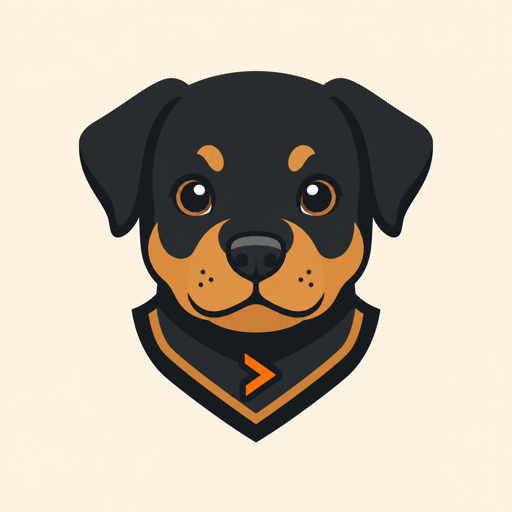

<p align="center">
  
</p>

# Rottweiler

Rottweiler is a local coding-agent harness with a headless Rust engine and an
[OpenTUI](https://github.com/sst/opentui) terminal client. It keeps model
providers behind one internal message format, gives interactive and scripted
clients the same session engine, and treats permissions, replay, persistence,
and extensions as product foundations rather than UI concerns.

Rottweiler is currently pre-v1. Build it from source or use the Homebrew HEAD
formula for development and evaluation. Signed stable artifacts are not
advertised until the repository's protected release gates have passed.


## Highlights

- **Interactive and headless workflows.** Run the supervised TUI with `rw`, a
  one-shot prompt with `rw -p`, or the line client with `rw --line`.
- **Provider-independent sessions.** Configure model aliases and fallback
  chains across Anthropic, OpenAI-compatible APIs, ChatGPT subscription access,
  GitHub Copilot subscription access, and local OpenAI-compatible endpoints.
  Typed gateway controls cover static and credential-backed headers, primary
  auth header scheme, query/body additions, path templates, model-id remapping,
  and user-declared pricing while keeping wire dialects closed.
- **Deliberate execution modes.** Discuss, plan, and execute modes are built in;
  trusted declarative modes can add project-specific behavior and tool limits.
- **Durable work.** Event-sourced sessions support resume, fork, rewind,
  checkpoints, replay, search, and redacted Markdown, HTML, or JSON export.
- **Coding tools included.** File operations, search, sandboxed shell commands,
  project intelligence, web access, MCP, background processes, and parallel
  subagents use the same permission and audit boundaries.
- **Extensible without embedding JavaScript.** Declarative commands, skills,
  agents, modes, workflows, RPC plugins, and capability-scoped WASM hooks extend
  the engine through documented protocols. Protocol-2 provider plugins publish
  bounded model catalogs and use host-mediated authenticated HTTP: the plugin
  names an approved credential reference but never receives the raw secret.
- **Visible resource use.** Context, token usage, cache behavior, API cost or
  provider credits, compaction, and tool activity remain inspectable.

## Install

### Homebrew HEAD build

The HEAD formula builds the complete application bundle from the current
source:

```sh
brew install --HEAD Boredphilosopher96/tap/rottweiler
rw
```

Upgrade a HEAD installation with `brew upgrade --fetch-HEAD rottweiler`.

### Build from source

Source builds require Rust 1.97.1 and Bun 1.3.14. The TUI is compiled into a
self-contained executable; Node is not required at runtime.

```sh
git clone https://github.com/Boredphilosopher96/Rottweiler.git
cd Rottweiler

bun install --cwd packages/tui --frozen-lockfile
scripts/cargo-release.sh build --locked --release -p rw-cli
bun run --cwd packages/tui build

release_dir=$(scripts/cargo-release.sh artifact-dir)
ROTTWEILER_TUI_BIN="$PWD/packages/tui/dist/rottweiler-tui" "$release_dir/rw"
```

`cargo install rw-cli` is not a complete installation: Cargo does not install
the compiled TUI and its native renderer alongside the Rust supervisor.

## Quick start

Run these commands from the repository you want Rottweiler to work in:

```sh
rw config check
rw doctor
rw models list --refresh
rw
```

`rw doctor` is network-free by default. Use `rw doctor --network` only when you
want bounded provider reachability and credential checks.

Configure providers in `~/.rottweiler/config.toml`. For example, an Anthropic
API-key route can use a credential reference rather than storing a secret in
TOML:

```toml
[models]
default = "fast"

[models.aliases]
fast = ["anthropic/<model-id>"]

[providers.anthropic]
kind = "anthropic"
api_key_credential = "providers.anthropic.api_key"
```

Replace `<model-id>` with a model returned by provider discovery, validate the
configuration, then enter the key through the hidden terminal prompt:

```sh
rw config check
rw auth set-key anthropic
rw models list --refresh
```

For an OpenAI-compatible gateway, use `openai_compatible` or
`openai_compatible_responses`. User-scoped provider configuration supports
`headers`, credential-referenced `header_credentials`, bearer/custom-header/no
primary auth, `extra_query`, `extra_body`, a `{model}` `path_template`, and
`model_ids` remapping. This is enough to configure OpenRouter- and Azure
OpenAI-shaped routes without Rust changes. It is still a typed gateway surface,
not an arbitrary wire dialect: `base_url` cannot contain a query string (use
`extra_query`), primary auth cannot be placed in a query parameter, reserved or
duplicate-auth headers are rejected, and subscription/Copilot transports cannot
be overridden. `[providers]` is ignored in project config even when trusted.

Per-model `[providers.<name>.pricing.<model>]` records can declare USD API
rates. Precedence is whole-record: user config, then authenticated
provider-discovered pricing, then models.dev; fields are not blended between
sources. `rw config check` renders declared records as `source = user_config`.
ChatGPT subscription and Copilot keep quota/AI-credit accounting, and reject
dollar-pricing declarations rather than appearing as `$0` API routes.

For a configured browser or device-flow provider, use `rw auth login
<provider>`. ChatGPT and GitHub Copilot subscription credentials are isolated
from normal API-key providers; Rottweiler does not copy credentials from other
developer tools.

## Everyday workflows

| Task | Command |
|---|---|
| Start the interactive application | `rw` |
| Run one prompt | `rw -p "review this repository"` |
| Stream machine-readable events | `rw -p "run the tests" --output-format stream-json` |
| Pipe context into a prompt | `git diff --staged \| rw -p "review this patch"` |
| Resume a session | `rw --resume <session-id>` |
| Continue the latest session | `rw --continue` |
| List or search sessions | `rw sessions list`; `rw sessions search <query>` |
| Replay or export history | `rw replay <session-id>`; `rw export <session-id>` |
| Inspect effective configuration | `rw config check` |
| Inspect available models | `rw models list --refresh` |
| Diagnose the local installation | `rw doctor` |
| Inspect historical usage | `rw stats` |
| Import supported project configuration | `rw import <claude\|opencode\|pi> --source-root <path> --dry-run` |

Inside the TUI, `/help` lists commands and active keybindings. Common controls
include `/mode`, `/models`, `/permissions`, `/context`, `/compact`, `/plan`,
`/agents`, `/mcp`, `/rewind`, `/review`, and `/trust`. Shift+Tab cycles the live
mode catalog; `Ctrl+O` opens the mode picker, and `Alt+M` opens the model picker.

For non-interactive automation, choose an explicit permission policy and bound
the turn count:

```sh
rw -p "run the focused test suite" \
  --permission-mode strict \
  --max-turns 12 \
  --output-format json
```

`strict`, `auto-safe`, and `yolo` are available. `yolo` removes interactive
approval prompts; it does not bypass workspace boundaries, trust validation,
or platform sandbox behavior.

## Trust and security

Rottweiler separates permission to read a repository from permission to execute
repository-controlled configuration.

- User configuration lives under `~/.rottweiler/`.
- Project configuration, commands, skills, agents, plugins, MCP servers, hooks,
  and custom modes remain inert until their exact project extension inventory
  is trusted.
- `rw trust status` shows the inventory and decision; `rw trust grant` records
  approval for that exact inventory; changes invalidate the decision.
- Security-sensitive settings such as permissions, network/proxy policy,
  sandbox rules, telemetry, and update channel remain user-scoped.
- API keys and OAuth tokens are kept out of configuration rendering, session
  logs, replay, exports, and provider/model UI state.
- Shell and plugin execution passes through permission checks and the supported
  platform sandbox. Outbound access uses guarded provider and sandbox-proxy
  boundaries.

`--dangerously-trust` is intended for controlled automation where the checkout
identity is established outside Rottweiler. It does not persist a trust
decision.

See the [security model](docs/05-SECURITY.md) for the threat model, sandbox
coverage, permission semantics, credential handling, and acceptance tests.
Report suspected vulnerabilities through the private process in
[SECURITY.md](SECURITY.md), not a public issue.

## Configuration and extensions

Configuration precedence is built-in defaults, user configuration, trusted
project configuration, environment overrides, then CLI overrides. `rw config
check` prints the effective value and provenance of each setting.

Project conventions use open, repository-local files:

- `AGENTS.md` for instructions, including nested directory scope.
- `.agents/commands/` and `.agents/skills/` for reusable prompts and resources.
- `.agents/agents/` and `.agents/workflows/` for subagents and orchestration.
- `.agents/modes/` for trusted declarative interaction modes.
- `.agents/hooks.toml` for trust-gated shell hooks.
- `.agents/mcp.toml` and `.agents/plugins.toml` for integrations with separate,
  fingerprint-bound approval checks.

The `.rottweiler/` project namespace remains supported at lower precedence for
Rottweiler-specific configuration. Plugin authors can start with:

```sh
rw plugin scaffold --lang ts ./my-plugin
cd my-plugin
bun install
bun test
bun run build
```

Read [Extensibility](docs/04-EXTENSIBILITY.md) before granting capabilities or
shipping an extension. The generated TypeScript SDK, wire schemas, and session
event envelope are maintained in `packages/plugin-sdk/` and `protocol/`.

Invalid, unreadable, or unsafe declarative artifacts are skipped with diagnostics
in tracing, `rw doctor`, and engine startup notifications; an artifact failure
does not prevent startup. “Fail closed” means the affected artifact does not
load. If an untrusted project root cannot be inventoried completely, its partial
inventory is discarded, it has no trust fingerprint, and `rw trust grant`
refuses it.

## Platform support

The complete release layout targets Apple Silicon macOS (`darwin-arm64`) and
x86-64 Linux/WSL (`linux-x86_64`). macOS uses Seatbelt-based command isolation;
Linux uses the repository's Landlock and network-namespace security gates.
Native Windows, Intel macOS, and Arm Linux are not part of the current signed
release matrix. Platform-specific behavior must pass its native CI or protected
runner gate before it is treated as release-qualified.

## Architecture

The public command supervises separate engine and TUI processes, but they are
installed, launched, upgraded, and stopped as one application. The main code
boundaries are:

| Path | Responsibility |
|---|---|
| `crates/rw-core` | Session engine, context loop, permissions, orchestration |
| `crates/rw-runtime` | Reusable runtime composition and session factories |
| `crates/rw-cli` | CLI, presentation, transports, and process supervision |
| `crates/rw-providers` | Provider adapters, routing, auth, and record/replay |
| `crates/rw-tools` | Built-in tools, background tasks, worktree isolation |
| `crates/rw-store` | Sessions, checkpoints, configuration, trust, credentials |
| `crates/rw-sandbox` | Platform sandbox and policy-controlled egress |
| `crates/rw-ext` / `crates/rw-mcp` | Extension and MCP protocol surfaces |
| `packages/tui` | Bun-compiled OpenTUI client |
| `packages/plugin-sdk` | TypeScript plugin SDK |
| `protocol` | Generated client schemas and documented session envelopes |

See [Architecture](docs/02-ARCHITECTURE.md) for the process and data-flow model,
and [Architecture decisions](docs/03-DECISIONS.md) for the rationale behind the
boundaries.

## Verification and contributing

The normal local gate is:

```sh
cargo fmt --all -- --check
cargo clippy --locked --workspace --all-targets --all-features -- -D warnings
cargo test --locked --workspace --all-features
cargo run --locked --quiet -p xtask -- codegen --check
RUSTDOCFLAGS="-D warnings" cargo doc --locked --workspace --no-deps
python3 -m unittest discover -s scripts/tests -p 'test_*.py'
python3 scripts/check-dependency-direction.py
python3 scripts/check-network-boundaries.py

bun install --cwd packages/plugin-sdk --frozen-lockfile
bun install --cwd packages/tui --frozen-lockfile
bun run --cwd packages/plugin-sdk test
bun run --cwd packages/plugin-sdk typecheck
bun run --cwd packages/plugin-sdk build
bun run --cwd packages/tui test
bun run --cwd packages/tui typecheck
bun run --cwd packages/tui build
```

Supply-chain, platform security, performance, replay, release packaging,
protected soak, WSL2, and capability-evaluation gates are described in
[Verification](docs/07-VERIFICATION.md). Architectural changes should also
follow [PROJECT.md](PROJECT.md) and the recorded ADRs.

Documentation map:

- [Feature reference](docs/01-FEATURES.md)
- [Architecture](docs/02-ARCHITECTURE.md)
- [Architecture decisions](docs/03-DECISIONS.md)
- [Extensibility](docs/04-EXTENSIBILITY.md)
- [Security model](docs/05-SECURITY.md)
- [Verification strategy](docs/07-VERIFICATION.md)
- [Historical implementation roadmap](docs/06-ROADMAP.md)
- [Archived implementation reviews](docs/gaps/README.md)
- [Protocol and session-log contracts](protocol/README.md)

## License

Licensed under the [Apache License 2.0](LICENSE).
