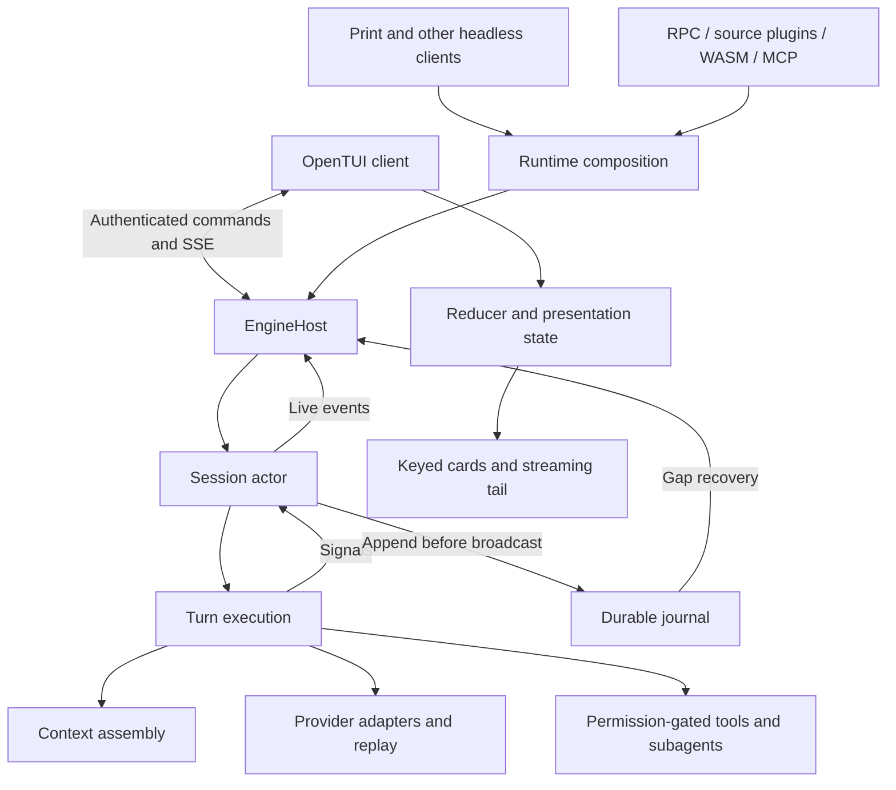

# Rottweiler architecture review against the product mission

Reviewed 2026-09-04 at `c729e3bf4d87b6c80f6a2e8655ed935aeb67cafd`.

Mission: extreme performance, pi-level extensibility, OpenCode-quality visual design and interaction, and room for Claude Code-level capabilities. Backward compatibility is not a constraint for the recommendations below.

This is an architecture assessment, not a feature-completion audit. Missing screens are acceptable. Missing ownership, resource bounds, lifecycle contracts, or extension points that make those screens expensive to add are architectural findings. Product implementation was not changed. The accompanying probes are review evidence.

## Verdict

Keep the Rust engine and OpenTUI process split, the session actor, provider-neutral IR, generated contracts, and durable replay. Those are good choices for this mission. A wholesale rewrite would discard useful work.

The architecture needs substantial changes inside those boundaries. Its current performance strategy too often bounds a symptom: truncate visible history, restart a growing renderer, cap a queue without proving progress, or limit one object without limiting aggregate memory. Several important operations still scale with the entire session or workspace. Those choices become more expensive as sessions, plugins, and concurrent agents grow.

The biggest extensibility gap is control. Registering tools and receiving hooks does not yet give an extension enough authority to implement pi-style workflows, persistent session state, or custom interactions. The biggest UX gap is a durable, paged presentation model with coherent client state. More polished screens alone will not fix either issue.

**Delivery reliability is the first priority.** Live GitHub evidence shows the latest 13 ordinary CI runs failed. Deterministic contract drift, a platform parser bug, incomplete dependency updates, missing protected runners, and real performance/size failures are mixed together. C01–C08 below define the stabilization workstream and its exit criteria. This is both CI design debt and product-boundary debt, not evidence that every failure is random.

Two liveness problems were reproduced with focused probes: ordered parallel output can exhaust the permits needed by the tool that must finish first, and an SDK handler can block the input pump needed for its own host-HTTP response. Fix these before expanding plugin and parallel execution workloads.

| Mission | Assessment | Most important change |
| --- | --- | --- |
| Extreme performance | Good implementation languages and isolation; insufficient aggregate bounds and scaling evidence | Indexed replay, bounded streaming with progress guarantees, shared resource admission, realistic end-to-end measurement |
| pi-level extensibility | Useful registries and isolation; incomplete workflow and UI control | Typed session/context capabilities, persistent extension state, presentation contributions, reliable duplex lifecycle |
| OpenCode-quality UI/UX | Real OpenTUI components and an established visual direction; fragile history and interaction foundations | Paged transcript virtualization, complete client-state recovery, one focus/overlay model |
| Claude Code-level feature growth | Many useful foundations already exist | Separate durable tasks, workspace services, execution ownership, and shared budgets from incidental turn/tool behavior |

## Evidence and scope

The review traced source across runtime composition, the session actor and host, storage/recovery, context assembly, tools/checkpoints, orchestration, extensions/providers/MCP, the plugin SDK, TUI transport/state/rendering, and verification contracts. Three independent exploration passes covered the engine, extensions, and TUI; their findings were reconciled against source.

Evidence labels mean:

- **Reproduced:** a focused executable probe demonstrated the stated failure. Probe scope is stated explicitly.
- **Confirmed design gap:** the implementation directly establishes the behavior or missing boundary.
- **Performance hypothesis:** source establishes the work or allocation pattern; production cost has not been measured here.
- **Growth requirement:** a proposed foundation for a plausible future capability, not a claim that the feature must ship now.

No full Rust/Bun suite, protected benchmark, eight-hour soak, paid model evaluation, or live terminal design comparison was run. Existing benchmark values are historical evidence, not fresh measurements of this checkout. The follow-up CI investigation queried live GitHub runs, failed-job logs, selected artifacts, repository runners, dependency PR diffs, remote configuration, and the active ruleset on September 4. It did not rerun workflows or change hosted settings. Hosted failures are identified by their own SHA rather than treated as fresh execution of this checkout. This is broad architectural coverage, not a claim that every implementation defect has been enumerated.

External products are behavioral references, not specifications to copy wholesale. pi documents session control, lifecycle hooks, state, and custom UI in its [extension documentation](https://github.com/earendil-works/pi/blob/main/packages/coding-agent/docs/extensions.md). OpenCode's current v2 [CLI plugin documentation](https://opencode.ai/v2/docs/build/plugins/cli/) provides a reference for extensible terminal interaction. Claude Code documents isolated [subagents](https://code.claude.com/docs/en/sub-agents), coordinated [agent teams](https://code.claude.com/docs/en/agent-teams), and [checkpointing](https://code.claude.com/docs/en/checkpointing). These references do not establish comparative speed or access to Claude Code's internal architecture.

## How the current architecture works

`rw-cli` owns the public executable, transport, and process supervision. Interactive use starts a separate compiled Bun/OpenTUI client. Headless execution does not need the TUI. `EngineHost` routes authenticated commands to sessions and owns session registration, driver identity, request deduplication, client reply channels, and authentication attempts. A session has one mutating driver and can have observers. See [crates/rw-cli/src/supervisor.rs:430](/Users/sumukhnitundila/MyProjects/Rottweiler/crates/rw-cli/src/supervisor.rs:430) and [crates/rw-core/src/host.rs:974](/Users/sumukhnitundila/MyProjects/Rottweiler/crates/rw-core/src/host.rs:974).

`RuntimeSessionFactory` composes storage, provider adapters, permissions, tools, hooks, commands, modes, checkpoints, and recovery state into a `SessionActor`. The actor owns session mutation. Turn execution runs separately and sends signals back to the actor. The reusable host boundary exists, although `rw-runtime::session::run` also contains print/REPL presentation. See [crates/rw-runtime/src/session_host.rs:1732](/Users/sumukhnitundila/MyProjects/Rottweiler/crates/rw-runtime/src/session_host.rs:1732), [crates/rw-runtime/src/lib.rs:84](/Users/sumukhnitundila/MyProjects/Rottweiler/crates/rw-runtime/src/lib.rs:84), and [crates/rw-runtime/src/session_runtime.rs:1261](/Users/sumukhnitundila/MyProjects/Rottweiler/crates/rw-runtime/src/session_runtime.rs:1261).

Each model iteration assembles context and tool schemas, calls the selected provider through normalized IR, and processes streamed text, reasoning, tool calls, and usage. Permission and hook handling precede tool execution. A batch runs concurrently only if all executable calls qualify as read-only. Output and results are coordinated into tool-call order. Text already coalesces over a 2 ms interval, and tool output already has byte, chunk-count, and in-flight limits. See [crates/rw-core/src/engine/turn/mod.rs:3633](/Users/sumukhnitundila/MyProjects/Rottweiler/crates/rw-core/src/engine/turn/mod.rs:3633), [crates/rw-core/src/engine/turn/mod.rs:4787](/Users/sumukhnitundila/MyProjects/Rottweiler/crates/rw-core/src/engine/turn/mod.rs:4787), and [crates/rw-core/src/engine/turn/mod.rs:2087](/Users/sumukhnitundila/MyProjects/Rottweiler/crates/rw-core/src/engine/turn/mod.rs:2087).

Durable events receive monotonic sequence IDs and are appended before broadcast. Connection-scoped replies and ephemeral authentication challenges have separate lifetimes. The persisted event log is authoritative for recovery and missed-event replay; live broadcasts are a delivery mechanism. The TUI consumes HTTP/SSE, reduces events and advances its cursor, then schedules presentation separately. Keyed historical cards and a separate streaming tail avoid rebuilding every renderer object on every delta. However, the current history view retains 256 entries and mounts only the newest 16. See [crates/rw-core/src/engine/turn/mod.rs:1602](/Users/sumukhnitundila/MyProjects/Rottweiler/crates/rw-core/src/engine/turn/mod.rs:1602), [packages/tui/src/app.ts:1297](/Users/sumukhnitundila/MyProjects/Rottweiler/packages/tui/src/app.ts:1297), and [packages/tui/src/components/transcript.ts:1750](/Users/sumukhnitundila/MyProjects/Rottweiler/packages/tui/src/components/transcript.ts:1750).

Native RPC plugins, the separately hosted TypeScript plugin path, WASM helpers, and MCP adapters feed registries and engine capabilities. Built-in provider wire formats remain in adapters. Credentials and authenticated HTTP are host-owned; plugins can name approved credential references without receiving the secret. JavaScript stays outside the Rust engine. See [crates/rw-runtime/src/extension_runtime.rs:23](/Users/sumukhnitundila/MyProjects/Rottweiler/crates/rw-runtime/src/extension_runtime.rs:23), [crates/rw-runtime/src/source_plugin.rs:111](/Users/sumukhnitundila/MyProjects/Rottweiler/crates/rw-runtime/src/source_plugin.rs:111), and [crates/rw-types/src/ir.rs:63](/Users/sumukhnitundila/MyProjects/Rottweiler/crates/rw-types/src/ir.rs:63).

## Preserve these decisions

- Keep session mutation single-writer. Improve scheduling around the actor rather than sharing its state behind more locks.
- Keep engine/client process isolation and one installed product. It enables headless use, remote operation, and independent renderer recovery.
- Keep generated Rust/TypeScript contracts, decimal-string u64 IDs, explicit durable versus connection-scoped events, and cursor-ahead recovery.
- Keep provider-neutral IR and explicit provider capability/accounting metadata. Do not expose raw provider configuration or credentials to the TUI.
- Keep append-before-publication, deterministic semantic replay, secret redaction, fingerprint-bound permissions, and truthful checkpoint limitations.
- Keep the existing stable-prefix cache work, deterministic pruning, async compaction, bounded tool output, subagent limits, and clean-file Git checkpoint optimization. Recommendations below extend these mechanisms; they do not assume they are absent.
- Keep exact-artifact tests and the distinction between PR smoke and protected measurements. Improve workload validity and provenance rather than relaxing budgets.

## Findings that should drive the next architecture work

P1 means address before increasing the workload or building dependent capabilities. P2 means a material design improvement to schedule as part of the next architecture phase. P3 means defer until the associated capability or measurements justify it.

### A01. P1: Ordered output has a circular wait under saturation

**Reproduced, extracted production algorithm.** Every chunk acquires one of 32 shared permits before checking its tool index. Later tools retain permits in an ordered buffer. That buffer drains only after earlier tools finish. A later tool can therefore occupy all permits while the first tool waits to emit its first chunk. The actor queue is empty, so its consumer cannot release a permit. Cancellation is an escape; ordinary execution has no progress path.

Evidence: [crates/rw-core/src/engine/turn/mod.rs:1793](/Users/sumukhnitundila/MyProjects/Rottweiler/crates/rw-core/src/engine/turn/mod.rs:1793), [crates/rw-core/src/engine/turn/mod.rs:1836](/Users/sumukhnitundila/MyProjects/Rottweiler/crates/rw-core/src/engine/turn/mod.rs:1836), and [crates/rw-core/src/engine/turn/mod.rs:3747](/Users/sumukhnitundila/MyProjects/Rottweiler/crates/rw-core/src/engine/turn/mod.rs:3747). The probe copies the production coordinator verbatim with lightweight surrounding stubs. It is not a full-engine integration test.

Replace the shared permit policy with capacity reserved for the active tool, or independently byte-bounded per-tool spools and an ordered drain. Preserve deterministic durable result order. If later-tool progress should be visible immediately, give ephemeral progress a separate explicitly defined contract instead of forcing presentation order to equal commit order.

Acceptance: a full-engine test with a delayed first tool and a later tool saturating its buffer must finish without interruption. Cover cancellation, chunk-size extremes, and multiple saturated tools. See the [probe](/Users/sumukhnitundila/MyProjects/Rottweiler/docs/reviews/2026-09-04-architecture-evidence/ordered-output-probe/README.md).

### A02. P1: Reconnect and history paging repeatedly process the lifetime journal

**Confirmed design gap; production latency unmeasured.** `DurableEventSink::read_after` locks the writer's journal mutex and runs synchronous replay work inside an async method. `load_after` reads and hashes the complete file before selecting the suffix. Even an up-to-date cursor pays the complete read/hash cost. Subscriptions retain the returned gap in memory. Separate bounded history pages still scan and decode the full snapshot on each request.

Evidence: [crates/rw-runtime/src/session_runtime.rs:4838](/Users/sumukhnitundila/MyProjects/Rottweiler/crates/rw-runtime/src/session_runtime.rs:4838), [crates/rw-store/src/session.rs:309](/Users/sumukhnitundila/MyProjects/Rottweiler/crates/rw-store/src/session.rs:309), [crates/rw-store/src/session.rs:2614](/Users/sumukhnitundila/MyProjects/Rottweiler/crates/rw-store/src/session.rs:2614), and [crates/rw-core/src/engine/session.rs:290](/Users/sumukhnitundila/MyProjects/Rottweiler/crates/rw-core/src/engine/session.rs:290).

Use immutable journal segments, a sequence-to-offset index, bounded cursor pages, independent read handles, and recovery snapshots at durable sequence boundaries. Preserve corruption detection by validating sealed segments and active-tail invariants, rather than rehashing the entire lifetime on every suffix query. Indexes and snapshots must be rebuildable from authoritative records. Cold recovery also reads the complete journal today, so snapshots must bound cold-open memory and reconstruction work as well: [crates/rw-store/src/session.rs:2403](/Users/sumukhnitundila/MyProjects/Rottweiler/crates/rw-store/src/session.rs:2403).

Acceptance: measure bytes read, peak gap memory, writer lock time, append latency, and interrupt latency at 10K, 100K, and 1M events with several lagging observers. Empty-tail queries and last-100 replay should not scale with total lifetime history. At the same sizes, test process restart and interrupted active-segment recovery separately from renderer reattachment.

### A03. P1: Storage latency still controls actor responsiveness

**Confirmed design gap; production cost unmeasured.** The turn-signal channel is unbounded. Ordinary streamed events flow through single-event append paths; journal writes flush and fsync. Text has 2 ms coalescing, while thinking deltas are sent individually. The actor awaits persistence while handling a signal, so moving I/O to a blocking executor does not make that actor available to process another command.

Evidence: [crates/rw-core/src/engine/session.rs:1287](/Users/sumukhnitundila/MyProjects/Rottweiler/crates/rw-core/src/engine/session.rs:1287), [crates/rw-core/src/engine/session.rs:1390](/Users/sumukhnitundila/MyProjects/Rottweiler/crates/rw-core/src/engine/session.rs:1390), [crates/rw-core/src/engine/turn/mod.rs:5091](/Users/sumukhnitundila/MyProjects/Rottweiler/crates/rw-core/src/engine/turn/mod.rs:5091), [crates/rw-runtime/src/session_runtime.rs:4749](/Users/sumukhnitundila/MyProjects/Rottweiler/crates/rw-runtime/src/session_runtime.rs:4749), and [crates/rw-store/src/session.rs:2450](/Users/sumukhnitundila/MyProjects/Rottweiler/crates/rw-store/src/session.rs:2450).

Introduce a journal writer with byte-bounded queues and explicit durable acknowledgements. Batch compatible append work by bounded time and bytes. Give cancellation and control messages a progress path independent of a full data queue. An asynchronous commit state machine must distinguish accepted work, committed state, and public events; never acknowledge durable success before the storage boundary actually commits.

Acceptance: inject slow fsync, disk-full, and append failures while streaming reasoning. Assert queue bounds, cancellation response, replay equivalence, and correct recovery at every batch boundary. Record oldest queued-event age as well as throughput.

### A04. P1: The transcript is a recent tail, not a virtualized history

**Confirmed design gap.** The reducer retains 256 entries. The component selects the newest 16 regardless of scroll position. Scrolling does not retrieve older top-level history. Child replay has pagination semantics, but the main transcript lacks the equivalent read contract. This blocks usable long sessions, search-result jumps, timeline inspection, and branch navigation.

Evidence: [packages/tui/src/state/reducer.ts:32](/Users/sumukhnitundila/MyProjects/Rottweiler/packages/tui/src/state/reducer.ts:32), [packages/tui/src/state/reducer.ts:159](/Users/sumukhnitundila/MyProjects/Rottweiler/packages/tui/src/state/reducer.ts:159), [packages/tui/src/components/transcript.ts:1787](/Users/sumukhnitundila/MyProjects/Rottweiler/packages/tui/src/components/transcript.ts:1787), and [packages/tui/src/components/transcript.ts:1814](/Users/sumukhnitundila/MyProjects/Rottweiler/packages/tui/src/components/transcript.ts:1814). The architecture's 10K-message virtualization claim and verification's 128-card description do not match source: [docs/02-ARCHITECTURE.md:475](/Users/sumukhnitundila/MyProjects/Rottweiler/docs/02-ARCHITECTURE.md:475), [docs/07-VERIFICATION.md:361](/Users/sumukhnitundila/MyProjects/Rottweiler/docs/07-VERIFICATION.md:361).

Add an engine-owned transcript projection with stable item IDs, a revision/through-sequence, and before/after paging. Put large bodies behind artifact references. The client needs a byte-bounded page cache, measured-height viewport virtualization, overscan, stable item-based scroll anchors, and a separately updated live tail.

Acceptance: navigate earliest/middle/latest messages in a 10K-message mixed transcript, append while scrolled away, resize, jump from search, and reconnect after page eviction. Assert both memory bounds and complete historical reachability.

### A05. P1: Renderer recycling is normal memory control and loses client state

**Confirmed design gap.** The client checks RSS every 100 ms and exits for supervised recycling at 384 MiB. The handoff stores only composer text and absolute scroll offset. Restoration clears attachments. Child drafts, current view, selection, and other interaction state are not represented by that envelope.

Evidence: [packages/tui/src/index.ts:262](/Users/sumukhnitundila/MyProjects/Rottweiler/packages/tui/src/index.ts:262), [packages/tui/src/app.ts:1686](/Users/sumukhnitundila/MyProjects/Rottweiler/packages/tui/src/app.ts:1686), and [packages/tui/src/app.ts:1695](/Users/sumukhnitundila/MyProjects/Rottweiler/packages/tui/src/app.ts:1695).

Attribute native and managed memory growth, then fix renderable/parser ownership or change the integration responsible for retained allocation. Treat recycling as exceptional recovery. While it remains, persist a complete, safe client-state envelope: session/view identity, parent/child drafts, attachment references, stable scroll anchor, and restorable interaction state. Revalidate restored attachments; never persist ephemeral authentication secrets.

Acceptance: force recycling while composing attachments, inspecting a child, reviewing a diff, and scrolling history. No accepted user input may disappear. Soak metrics must include recycle count, input blackout, and restoration time, not just maximum RSS.

### A06. P1: Plugin SDK request handling can block its own replies

**Reproduced against the production SDK input loop.** `serve()` awaits each ordinary handler. A `provider/models` handler that awaits host-mediated HTTP prevents the loop from consuming the host's queued HTTP response. The handler times out even when the host responds immediately. `provider/complete` has a detached path, but ordinary handlers do not.

Evidence: [packages/plugin-sdk/src/server.ts:509](/Users/sumukhnitundila/MyProjects/Rottweiler/packages/plugin-sdk/src/server.ts:509), [packages/plugin-sdk/src/server.ts:567](/Users/sumukhnitundila/MyProjects/Rottweiler/packages/plugin-sdk/src/server.ts:567), [packages/plugin-sdk/src/server.ts:697](/Users/sumukhnitundila/MyProjects/Rottweiler/packages/plugin-sdk/src/server.ts:697), and [packages/plugin-sdk/src/server.ts:933](/Users/sumukhnitundila/MyProjects/Rottweiler/packages/plugin-sdk/src/server.ts:933).

Keep the input pump alive independently of application handlers. Dispatch requests through a bounded scheduler with separate reply/cancellation/control handling, per-request ownership, and shutdown draining. Unlimited detached handlers would exchange a deadlock for an overload problem. The SDK writer bounds individual frames but eagerly serializes frames into a promise chain without an aggregate byte queue limit: [packages/plugin-sdk/src/transport.ts:60](/Users/sumukhnitundila/MyProjects/Rottweiler/packages/plugin-sdk/src/transport.ts:60). The Rust provider-event path can instead terminate the shared connection on a full 64-item delivery queue: [crates/rw-ext/src/plugin_runtime.rs:1270](/Users/sumukhnitundila/MyProjects/Rottweiler/crates/rw-ext/src/plugin_runtime.rs:1270). Define byte admission, stream credits, and overload outcomes for both directions.

Acceptance: nested host HTTP from authorized provider/catalog contexts, unrelated slow tool/hook handlers, timeout, cancellation, and shutdown. Preserve the provider-scoped HTTP authority; ordinary tools/hooks do not gain it. Exercise slow pipes, concurrent pushes, bursty provider deltas, and unrelated request survival. The [duplex probe](/Users/sumukhnitundila/MyProjects/Rottweiler/docs/reviews/2026-09-04-architecture-evidence/plugin-duplex-probe.md) currently reproduces the failure using an 80 ms deadline and an in-memory transport. It performs no network call.

### A07. P1: Extension control is too narrow for the stated mission

**Confirmed design gap.** The public extension model emphasizes tools, hooks, commands, providers, and three pushes: inject a message, set status, and notify. It lacks a general typed capability contract for querying session state, persisting extension state, editing the assembled context, controlled session navigation, and interacting with the client. These are the kinds of controls pi makes available to extensions.

Evidence: [docs/04-EXTENSIBILITY.md:113](/Users/sumukhnitundila/MyProjects/Rottweiler/docs/04-EXTENSIBILITY.md:113) and the contracts in `crates/rw-plugin-protocol/src/lib.rs`. The comparison is about extension authority, not matching pi's process model.

Define capability-scoped session queries and commands, lifecycle/context interception, and durable namespaced extension records. Make ownership explicit: extension commands still enter the actor, permissions remain host-enforced, mutations are replayable, and persistent state declares fork/rewind/compaction behavior. Keep observation hooks separate from policy decisions and state transformations.

Acceptance: implement representative third-party workflows without modifying core: a context-management extension, a persistent task workflow, a session navigation command, and a rich tool interaction. Use the same APIs for at least one built-in of each category.

### A08. P2: The runtime boundary still owns terminal presentation

**Confirmed design gap.** `rw-runtime` imports `rustyline`, prints events and JSON to process stdout/stderr, owns a REPL, and exports a command-style `session::run`. This contradicts the claimed reusable composition/presentation split and gives headless integrations a different entry path from the hosted TUI.

Evidence: [crates/rw-runtime/src/lib.rs:44](/Users/sumukhnitundila/MyProjects/Rottweiler/crates/rw-runtime/src/lib.rs:44), [crates/rw-runtime/src/session_runtime.rs:1261](/Users/sumukhnitundila/MyProjects/Rottweiler/crates/rw-runtime/src/session_runtime.rs:1261), [crates/rw-runtime/src/session_runtime.rs:12423](/Users/sumukhnitundila/MyProjects/Rottweiler/crates/rw-runtime/src/session_runtime.rs:12423), and [crates/rw-runtime/src/session_runtime.rs:12685](/Users/sumukhnitundila/MyProjects/Rottweiler/crates/rw-runtime/src/session_runtime.rs:12685).

Move print rendering, terminal input, and CLI interaction policy to `rw-cli`. Let runtime return a composed host/session plus explicit lifecycle handles. Keep the in-process transport optimization, but have all clients exercise the same semantic command and interaction contracts. An embedding API should return events/results instead of writing to the embedder's stdout or selecting answers on its behalf.

Acceptance: an embedded session runs with captured events and no terminal access; CLI and socket clients pass shared command, cancellation, approval, and recovery conformance scenarios. Extend architecture checks to actual forbidden imports and presentation calls, not only crate dependency directions.

### A09. P2: Command admission and retry semantics need stronger ownership

**Confirmed design gap.** Host deduplication is an in-memory cache. New request IDs insert running entries and spawn work before a general in-flight admission check. Capacity cleanup happens after completion. The configured deduplication size therefore does not bound running requests. Separately, completed request IDs can be forgotten after eviction or restart; that cache is not durable exactly-once execution.

Evidence: [crates/rw-core/src/host.rs:68](/Users/sumukhnitundila/MyProjects/Rottweiler/crates/rw-core/src/host.rs:68), [crates/rw-core/src/host.rs:1343](/Users/sumukhnitundila/MyProjects/Rottweiler/crates/rw-core/src/host.rs:1343), [crates/rw-core/src/host.rs:1412](/Users/sumukhnitundila/MyProjects/Rottweiler/crates/rw-core/src/host.rs:1412), and [crates/rw-core/src/host.rs:1481](/Users/sumukhnitundila/MyProjects/Rottweiler/crates/rw-core/src/host.rs:1481). HTTP connections are spawned independently and command bodies may be up to 16 MiB: [crates/rw-cli/src/server.rs:38](/Users/sumukhnitundila/MyProjects/Rottweiler/crates/rw-cli/src/server.rs:38), [crates/rw-cli/src/server.rs:683](/Users/sumukhnitundila/MyProjects/Rottweiler/crates/rw-cli/src/server.rs:683).

Add host/client/session admission limits with byte budgets and explicit busy responses. Keep a priority lane for interruption and small control requests. For mutations whose retries must survive disconnect/restart, persist an operation ID and outcome at the same durable boundary as acceptance. Retain the existing specialized fork journal; do not pretend an in-memory cache provides that guarantee generally.

Acceptance: many concurrent slow requests, oversized aggregate bodies, repeated request IDs, lost replies after durable acceptance, cache eviction, and engine restart. Document retry guarantees per command class.

### A10. P2: Tool scheduling is all-parallel or all-serial

**Confirmed design gap.** One mutating call makes the whole prepared batch serial. An all-read batch spawns every executable call. Individual argument/output limits and subagent concurrency limits do not substitute for a general tool-execution budget.

Evidence: [crates/rw-core/src/engine/turn/mod.rs:3617](/Users/sumukhnitundila/MyProjects/Rottweiler/crates/rw-core/src/engine/turn/mod.rs:3617), [crates/rw-core/src/engine/turn/mod.rs:3633](/Users/sumukhnitundila/MyProjects/Rottweiler/crates/rw-core/src/engine/turn/mod.rs:3633), and [crates/rw-core/src/engine/turn/mod.rs:3713](/Users/sumukhnitundila/MyProjects/Rottweiler/crates/rw-core/src/engine/turn/mod.rs:3713).

Start with bounded contiguous read batches separated by mutation barriers. Share process, network, blocking-I/O, and CPU admission across sessions. Later, use declared mutation scopes and verified resource conflicts for finer scheduling. Preserve checkpoint and approval ordering; do not parallelize arbitrary writes merely because paths appear different.

Acceptance: large call lists, mixed batches, slow approvals, cancellation, and multiple competing sessions. Bound active tasks, child processes, file descriptors, queued bytes, and queue wait time.

### A11. P2: Context assembly repeats work on unchanged content

**Performance hypothesis grounded in source.** Turn startup clones conversation state and a panic-recovery copy. Each provider iteration reconstructs prompt turns, surgery state, TOON encoding, tool definitions, canonical prefix representation, and estimates. Stable prefix hashing already exists, but does not make all of this assembly incremental.

Evidence: [crates/rw-core/src/engine/turn/mod.rs:1515](/Users/sumukhnitundila/MyProjects/Rottweiler/crates/rw-core/src/engine/turn/mod.rs:1515), [crates/rw-core/src/engine/turn/mod.rs:2335](/Users/sumukhnitundila/MyProjects/Rottweiler/crates/rw-core/src/engine/turn/mod.rs:2335), [crates/rw-context/src/assembly.rs:207](/Users/sumukhnitundila/MyProjects/Rottweiler/crates/rw-context/src/assembly.rs:207), and [crates/rw-context/src/estimate.rs:23](/Users/sumukhnitundila/MyProjects/Rottweiler/crates/rw-context/src/estimate.rs:23).

Use immutable/shared blocks with revisions and cached canonical bytes, rendered tool output, and token estimates. Cache tool-schema/prefix projections by registry revision. Update running totals and rebuild changed items. Keep a simple full assembler as a correctness oracle; invalidation must cover model switches, instructions, pins/evictions, pruning, compaction, and tool registration changes.

Acceptance: byte-identical requests between incremental and full assembly across those changes. Measure allocation volume and p99 assembly overhead at realistic context sizes before selecting cache granularity.

### A12. P2: Spend limits observe usage but do not reserve in-flight cost

**Confirmed semantics gap.** The engine checks accumulated usage before starting another request. Concurrent sessions or children can each pass against the same remaining daily budget. A single request can consume more than the remainder before its usage is reported.

Evidence: [crates/rw-core/src/engine/turn/mod.rs:4734](/Users/sumukhnitundila/MyProjects/Rottweiler/crates/rw-core/src/engine/turn/mod.rs:4734), [crates/rw-core/src/engine/turn/mod.rs:4909](/Users/sumukhnitundila/MyProjects/Rottweiler/crates/rw-core/src/engine/turn/mod.rs:4909), and [crates/rw-runtime/src/session_runtime.rs:4858](/Users/sumukhnitundila/MyProjects/Rottweiler/crates/rw-runtime/src/session_runtime.rs:4858).

Define a shared budget owner with atomic reservations and settlement across sessions and engine processes. The accounting database is shared through the storage root, so a process-local host semaphore is insufficient: [crates/rw-store/src/session.rs:948](/Users/sumukhnitundila/MyProjects/Rottweiler/crates/rw-store/src/session.rs:948). Use transactional reservations scoped to that accounting root, with cross-process exclusion and recovery. Reserve known input plus a bounded output allowance where pricing and provider behavior permit it. Preserve distinctions among USD, credits, subscriptions, and unavailable pricing. Where spend cannot be bounded, label the limit best-effort instead of implying a strict cap.

Acceptance: concurrent requests from two engine processes against a small remainder, cancellation, crashes, provider failures, corrected usage, and mixed billing units. This matters as soon as agents run concurrently, regardless of whether a team UI ships.

### A13. P2: Checkpoint capture can allocate without a file-size budget

**Confirmed design gap; scale cost unmeasured.** Clean tracked files already use Git baselines. However, opaque mutation setup still inventories the workspace and queries Git, and dirty-file preimages can use unbounded `read_to_end`. Review display caps do not bound capture memory.

Evidence: [crates/rw-store/src/checkpoint.rs:334](/Users/sumukhnitundila/MyProjects/Rottweiler/crates/rw-store/src/checkpoint.rs:334), [crates/rw-store/src/checkpoint.rs:1050](/Users/sumukhnitundila/MyProjects/Rottweiler/crates/rw-store/src/checkpoint.rs:1050), and [crates/rw-store/src/checkpoint.rs:1796](/Users/sumukhnitundila/MyProjects/Rottweiler/crates/rw-store/src/checkpoint.rs:1796).

Use chunked, content-addressed preimages with file/operation/workspace quotas and cancellable scans. Reuse workspace inventory where freshness can be established, with reconciliation for external edits. When a file cannot be captured safely, expose the exact unrestorable limitation before promising rewind. A display truncation must never masquerade as a complete checkpoint.

Acceptance: huge dirty files, large monorepos, generated directories, disk-full, interruption, and external changes. Measure command-start overhead separately from the command itself.

### A14. P2: Workspace intelligence lacks an aggregate cache and freshness contract

**Confirmed design gap.** Index limits cap files, bytes per file, and symbols per file, but not total retained bytes. Each indexed file retains source, syntax tree, and symbols. Default ceilings allow 20,000 files of 2 MiB each; that arithmetic is roughly 39 GiB of source alone, not a measured allocation. Tool composition creates a new workspace index, so concurrent sessions can duplicate it. Lazy symbol and intelligence paths also have separate initialization flags.

Evidence: [crates/rw-intel/src/lib.rs:117](/Users/sumukhnitundila/MyProjects/Rottweiler/crates/rw-intel/src/lib.rs:117), [crates/rw-intel/src/lib.rs:166](/Users/sumukhnitundila/MyProjects/Rottweiler/crates/rw-intel/src/lib.rs:166), [crates/rw-runtime/src/session_runtime.rs:11402](/Users/sumukhnitundila/MyProjects/Rottweiler/crates/rw-runtime/src/session_runtime.rs:11402), [crates/rw-runtime/src/session_runtime.rs:11861](/Users/sumukhnitundila/MyProjects/Rottweiler/crates/rw-runtime/src/session_runtime.rs:11861), and [crates/rw-runtime/src/session_runtime.rs:12008](/Users/sumukhnitundila/MyProjects/Rottweiler/crates/rw-runtime/src/session_runtime.rs:12008).

Built-in file mutations update the index, but no production workspace watcher was found among the index-update callers. External editor/shell changes need an explicit invalidation path. See [crates/rw-tools/src/files.rs:537](/Users/sumukhnitundila/MyProjects/Rottweiler/crates/rw-tools/src/files.rs:537) and [crates/rw-intel/src/lib.rs:345](/Users/sumukhnitundila/MyProjects/Rottweiler/crates/rw-intel/src/lib.rs:345).

Create a workspace-owned service keyed by canonical root, trust scope, and worktree identity. Give it a total byte budget, eviction policy, generation IDs, lazy indexing, and watcher/reconciliation invalidation. Share immutable index data only across equivalent authority scopes. Keep optional LSP process ownership separate and bounded.

Acceptance: large repositories, multiple sessions on one root, separate worktrees, external edits/deletes, branch switches, and trust changes. Assert fresh results and aggregate memory ceilings.

### A15. P2: The client accepts typed-looking wire data without validating its shape

**Reproduced with a malformed known event.** `normalizeWireEngineEvent` accepts an object containing only a string `type`. The reducer casts known events and dereferences fields. `{type:"command_acknowledged"}` is accepted and then throws on `event.meta.request_id`. Generic transport errors can reconnect without classifying a malformed known frame as terminal.

Evidence: [packages/tui/src/transport/types.ts:27](/Users/sumukhnitundila/MyProjects/Rottweiler/packages/tui/src/transport/types.ts:27), [packages/tui/src/state/reducer.ts:249](/Users/sumukhnitundila/MyProjects/Rottweiler/packages/tui/src/state/reducer.ts:249), [packages/tui/src/state/reducer.ts:340](/Users/sumukhnitundila/MyProjects/Rottweiler/packages/tui/src/state/reducer.ts:340), and [packages/tui/src/transport/client.ts:265](/Users/sumukhnitundila/MyProjects/Rottweiler/packages/tui/src/transport/client.ts:265).

Generate runtime validators from the same contract owner. Parse once into a validated event, with size/collection limits, then let reducers trust that type. Distinguish unsupported versions, unknown events, malformed known frames, and temporary disconnection. Since compatibility is unnecessary, reject incompatible known shapes explicitly rather than retaining permissive casts.

Acceptance: systematic field mutation, wrong payload shapes, invalid IDs, oversized collections, and corruption during replay. Fail visibly without advancing a cursor incorrectly or repeatedly reconnecting to the same poison frame.

### A16. P2: Client memory bounds need bytes and allocation accounting

**Performance hypothesis with confirmed allocation behavior.** Each tool-output delta copies the accumulated chunk array; finished tools retain both chunks and final output. Active text/reasoning tails grow as strings. Entry-count limits do not define total retained bytes or allocation work.

Evidence: [packages/tui/src/state/reducer.ts:926](/Users/sumukhnitundila/MyProjects/Rottweiler/packages/tui/src/state/reducer.ts:926), [packages/tui/src/state/reducer.ts:1034](/Users/sumukhnitundila/MyProjects/Rottweiler/packages/tui/src/state/reducer.ts:1034), and [packages/tui/src/state/reducer.ts:1060](/Users/sumukhnitundila/MyProjects/Rottweiler/packages/tui/src/state/reducer.ts:1060). Crucially, normal engine tool output is already capped at 1 MiB and 1,024 chunks plus a truncation marker: [crates/rw-core/src/engine/mod.rs:163](/Users/sumukhnitundila/MyProjects/Rottweiler/crates/rw-core/src/engine/mod.rs:163), [crates/rw-core/src/engine/turn/mod.rs:2098](/Users/sumukhnitundila/MyProjects/Rottweiler/crates/rw-core/src/engine/turn/mod.rs:2098). This is not a claim of unbounded normal tool streaming.

Use chunk structures that append without copying the entire prior array, batch presentation updates, and bound total cached bytes. Separate display tails from durable artifact bodies. Define per-active-turn and aggregate-client limits, including reasoning and image payloads, with truthful completeness metadata.

Acceptance: many tiny chunks within existing limits, multiple near-limit tools, long reasoning, and concurrent child inspection. Measure bytes retained and allocated per event, not only frame compute.

### A17. P2: UI interaction policy is centralized without a single state model

**Confirmed growth risk.** `RottweilerApp` owns views, pickers, auth, settings/MCP forms, child replay, drafts, timers, focus, commands, and platform behavior. Binding updates visit many components. Separate focus helpers prioritize overlays differently. This establishes inconsistent policy ownership, although a reachable focus bug was not reproduced.

Evidence: [packages/tui/src/app.ts:397](/Users/sumukhnitundila/MyProjects/Rottweiler/packages/tui/src/app.ts:397), [packages/tui/src/app.ts:1722](/Users/sumukhnitundila/MyProjects/Rottweiler/packages/tui/src/app.ts:1722), [packages/tui/src/app.ts:2922](/Users/sumukhnitundila/MyProjects/Rottweiler/packages/tui/src/app.ts:2922), and [packages/tui/src/app.ts:3058](/Users/sumukhnitundila/MyProjects/Rottweiler/packages/tui/src/app.ts:3058).

Introduce a typed route/session state, one overlay stack and focus arbiter, feature-owned controllers, and a shared query/projection broker. Bind views through relevant revisions/selectors. Keep draft ownership explicit across parent and child sessions. Splitting files without moving these responsibilities will not solve the problem.

Acceptance: overlay opens, approval arrives, session switches, an old query returns, then Escape is pressed. Assert one focus owner, correct modal capture, stale-result rejection, and draft restoration through every transition.

### A18. P2: Rich presentation has no third-party contribution contract

**Confirmed design gap.** Tool presenters use a built-in map with generic/MCP fallbacks. Views and pickers are concrete app fields. Extensions can report status or notifications but cannot contribute a coherent panel, tool detail view, interaction, or command presentation through a shared UI registry.

Evidence: [packages/tui/src/render/tool-presentation.ts:32](/Users/sumukhnitundila/MyProjects/Rottweiler/packages/tui/src/render/tool-presentation.ts:32), [packages/tui/src/app.ts:397](/Users/sumukhnitundila/MyProjects/Rottweiler/packages/tui/src/app.ts:397), and [docs/04-EXTENSIBILITY.md:113](/Users/sumukhnitundila/MyProjects/Rottweiler/docs/04-EXTENSIBILITY.md:113).

Define semantic contributions for tool summaries/details, actions, artifact links, commands, status locations, and panels. Built-ins must exercise this registry. Start with bounded declarative descriptors. If arbitrary trusted client renderers are required for pi-level freedom, make that a separate explicit trust tier with cleanup, error containment, and execution budgets. Rust remains terminal-independent.

Acceptance: a third-party tool with useful rich output and an action, a panel and command, remote artifact retrieval, reload/disconnect cleanup, malformed descriptors, and a slow renderer. The frame/input path must never synchronously wait for a plugin RPC.

### A19. P1: Current performance evidence does not prove the mission

**Confirmed evidence gap.** The retained-history frame fixture describes 10 MB but constructs 400 messages with roughly 1,020-byte payloads, about 0.4 MB of text, and asserts only 16 mounted entries. It uses mocked syntax highlighting and measures CPU around direct state binding/rendering. A separate tool-output fixture does exercise live Tree-sitter, which should be retained.

Evidence: [packages/tui/test/perf/performance.test.ts:61](/Users/sumukhnitundila/MyProjects/Rottweiler/packages/tui/test/perf/performance.test.ts:61). These compute tests are useful but do not measure the full parser/reducer/scheduler/terminal path or prove navigable large history.

The documented platform frame thresholds also do not prove sustained 60 fps. Historical baselines are mixed: macOS core is marked measured with local/mixed provenance; Linux core and both soak suites are bootstrap. The current `check-release-readiness.py` run fails specifically on Linux core calibration. See [benchmarks/performance-baseline.json:1](/Users/sumukhnitundila/MyProjects/Rottweiler/benchmarks/performance-baseline.json:1), [docs/07-VERIFICATION.md:191](/Users/sumukhnitundila/MyProjects/Rottweiler/docs/07-VERIFICATION.md:191), and [scripts/check-release-readiness.py:32](/Users/sumukhnitundila/MyProjects/Rottweiler/scripts/check-release-readiness.py:32).

Retain microbenchmarks and add exact-artifact end-to-end traces for input/SSE arrival, reduction, presentation, native output, and visible acknowledgement. Assert workload byte counts and reachable history. Separate first installation launch from warmed startup, CPU from wall time, and renderer compute from terminal display cadence. Use structured baseline provenance: source/artifact hash, toolchain, runner/image, workload revision, statistic, raw samples, and parser mode.

Acceptance: interactive stream plus typing, scrolling, resize, approvals, child activity, and slow storage. Include frame misses, queue age, process-tree RSS, recycle outages, replay bytes, and context-assembly allocation. Calibrate both platforms before claiming mission-level performance.

### A20. P2: Performance diagnosis lacks stage-level ownership

**Confirmed instrumentation gap in the reviewed hot paths.** The project has benchmark markers, prompt dumps, accounting, and a tracing subscriber. Searches across core turn execution, context, tools, and storage found little structured span coverage connecting those stages. Optional OpenTelemetry export is explicitly planned, not shipped.

Evidence: [crates/rw-cli/src/main.rs:856](/Users/sumukhnitundila/MyProjects/Rottweiler/crates/rw-cli/src/main.rs:856), [docs/01-FEATURES.md:130](/Users/sumukhnitundila/MyProjects/Rottweiler/docs/01-FEATURES.md:130), and the hot paths cited in A02/A03/A11.

Add low-overhead local timing/counter spans with request, turn, tool, and session IDs. Cover admission wait, context assembly, provider first event, hook latency, tool queue/execution, checkpoint capture, journal commit, replay, reducer, and render. Keep payloads and secrets out. Exporting telemetry can remain optional; local attribution is needed now to choose optimizations intelligently.

Acceptance: a deterministic slow-stage injection appears in the correct duration/queue metric. Measure instrumentation overhead with tracing disabled and enabled. Report provider time separately from harness overhead and token-economy results.

### A21. P1: Cancelling an ordinary plugin request does not settle its effects

**Confirmed design gap.** Ordinary RPC timeout/cancellation removes the pending reply and records an abandoned ID. It does not send a general tool/hook cancellation request or wait for effects to stop. The process is killed only once the abandoned-request threshold is reached. Provider cancellation has a separate protocol, but ordinary tools do not. Dropping the caller's future can therefore leave plugin work running after the engine reports failure.

Evidence: [crates/rw-ext/src/plugin_runtime.rs:531](/Users/sumukhnitundila/MyProjects/Rottweiler/crates/rw-ext/src/plugin_runtime.rs:531), [crates/rw-ext/src/plugin_runtime.rs:609](/Users/sumukhnitundila/MyProjects/Rottweiler/crates/rw-ext/src/plugin_runtime.rs:609), and [crates/rw-plugin-protocol/src/lib.rs:58](/Users/sumukhnitundila/MyProjects/Rottweiler/crates/rw-plugin-protocol/src/lib.rs:58).

Define universal operation IDs, cancellation requests, and settled acknowledgements. Revoke host-mediated capabilities immediately, then allow bounded cooperative shutdown. For native work that can continue effects independently, kill and reap its worker or process tree before releasing a conflicting mutation lease. A timeout response is not proof that a write stopped.

Acceptance: a plugin tries to mutate after cancellation. Subsequent conflicting work and checkpoint finalization must wait until that authority is revoked or execution is confirmed stopped. Include SDK handlers that ignore cancellation and a process that spawns children.

### A22. P2: WASM hooks pay process and compilation costs per invocation

**Confirmed mechanism; latency unmeasured.** Every invocation transfers component bytes to a fresh one-request helper. That helper builds a Wasmtime engine and compiles the component. A process-global semaphore permits only one helper operation at a time, coupling independent sessions.

Evidence: [crates/rw-ext/src/wasm_process.rs:25](/Users/sumukhnitundila/MyProjects/Rottweiler/crates/rw-ext/src/wasm_process.rs:25), [crates/rw-ext/src/wasm_process.rs:178](/Users/sumukhnitundila/MyProjects/Rottweiler/crates/rw-ext/src/wasm_process.rs:178), [crates/rw-wasm-host/src/main.rs:26](/Users/sumukhnitundila/MyProjects/Rottweiler/crates/rw-wasm-host/src/main.rs:26), and [crates/rw-ext/src/wasm.rs:144](/Users/sumukhnitundila/MyProjects/Rottweiler/crates/rw-ext/src/wasm.rs:144).

Use lazy supervised workers with a bounded fair queue and verified compiled-module cache keyed by component digest, target, engine version, and configuration. Use fresh stores/instances per invocation and retain import, fuel, memory, signature, and timeout restrictions. Keep Wasmtime out of the normal engine startup path. Supersede the relevant ADR before changing the isolation model.

Acceptance: cold/warm hook latency, compilation count, several concurrent sessions, trap/timeout recovery, and total worker RSS. Select pool size from measurements rather than assuming more workers are always faster.

### A23. P2: Plugin tools lack a proper long-operation contract

**Confirmed design gap.** Ordinary unary requests use a default five-second response deadline. Tool execution uses this path without a general progress/result stream. This makes normal long-running builds or analysis awkward to implement, independently of the input-loop failure in A06.

Evidence: [crates/rw-plugin-protocol/src/lib.rs:26](/Users/sumukhnitundila/MyProjects/Rottweiler/crates/rw-plugin-protocol/src/lib.rs:26), [crates/rw-ext/src/plugin_runtime.rs:531](/Users/sumukhnitundila/MyProjects/Rottweiler/crates/rw-ext/src/plugin_runtime.rs:531), and [crates/rw-ext/src/plugin_runtime.rs:1763](/Users/sumukhnitundila/MyProjects/Rottweiler/crates/rw-ext/src/plugin_runtime.rs:1763).

Separate startup/admission timeout, maximum total duration, progress/idle timeout, cancellation, and terminal settlement. Provide bounded progress events and final results or durable task handles. Let host policy cap overall work; periodic progress must not grant unlimited runtime.

Acceptance: a 60-second cancellable tool, a silent stalled tool, a chatty runaway tool, reconnect, and shutdown. The same lifecycle should serve RPC tools, background jobs, and future MCP task support.

### A24. P2: Plugin pushes discard the host's outcome

**Confirmed design gap.** SDK push calls return after writing a frame. Responses are routed to provider-HTTP handling; other response IDs are ignored. Rust has real injection dispositions and errors, but an extension cannot distinguish applied, queued, or rejected work through this API.

Evidence: [packages/plugin-sdk/src/server.ts:845](/Users/sumukhnitundila/MyProjects/Rottweiler/packages/plugin-sdk/src/server.ts:845), [packages/plugin-sdk/src/server.ts:987](/Users/sumukhnitundila/MyProjects/Rottweiler/packages/plugin-sdk/src/server.ts:987), and [crates/rw-runtime/src/extension_runtime.rs:2006](/Users/sumukhnitundila/MyProjects/Rottweiler/crates/rw-runtime/src/extension_runtime.rs:2006).

Make commands correlated requests with typed results and deadlines. Reserve fire-and-forget semantics for explicitly named notifications. Preserve engine ownership of injection ordering and permission decisions.

Acceptance: invalid-session and unauthorized commands reject in the SDK, queued injection returns its disposition, duplicate IDs behave predictably, and disconnect cannot leave an indefinitely pending promise.

### A25. P2: Plugin effect precision stops at process authority

**Confirmed tradeoff.** Tools inherit the union of their process's declared effects. A plugin with any write capability receives opaque-workspace mutation semantics. This is the correct conservative policy for a process with ambient authority, but makes nominally read-only helpers in a mixed package harder to schedule efficiently.

Evidence: [crates/rw-ext/src/plugin.rs:769](/Users/sumukhnitundila/MyProjects/Rottweiler/crates/rw-ext/src/plugin.rs:769) and [crates/rw-ext/src/plugin_runtime.rs:1741](/Users/sumukhnitundila/MyProjects/Rottweiler/crates/rw-ext/src/plugin_runtime.rs:1741).

To gain precision, enforce filesystem/process/network authority per invocation through host capabilities, or isolate workers by permission domain. Do not trust a per-tool declaration while the same process can still write through another route. Opaque native execution should remain conservative.

Acceptance: a mixed-capability extension cannot mutate during a read-only invocation. Only host-enforced read/path scopes qualify for more parallel execution or narrower checkpointing.

### A26. P2: Extension event delivery can lose state without recovery

**Confirmed design gap.** Event workers have bounded queues, timeout, and overflow disabling. That protects the engine, but no extension cursor/acknowledgement/snapshot recovery contract accompanies loss. Payload serialization, redaction, size measurement, and cloning also occur before subscription filtering finishes, on the append publication path.

Evidence: [crates/rw-runtime/src/session_runtime.rs:4955](/Users/sumukhnitundila/MyProjects/Rottweiler/crates/rw-runtime/src/session_runtime.rs:4955), [crates/rw-runtime/src/session_runtime.rs:5064](/Users/sumukhnitundila/MyProjects/Rottweiler/crates/rw-runtime/src/session_runtime.rs:5064), and [crates/rw-runtime/src/session_runtime.rs:5099](/Users/sumukhnitundila/MyProjects/Rottweiler/crates/rw-runtime/src/session_runtime.rs:5099).

Index subscribers by typed event kind before payload construction. Share one immutable sanitized encoding where policies match. Distinguish coalescible observations from durable ordered events; provide detectable gaps and bounded replay/snapshot recovery for the latter. An extension maintaining task state cannot safely infer correctness from a lossy notification feed.

Acceptance: a slow subscriber cannot delay engine streaming, dropped durable events are detectable and recoverable, and unsubscribed large events incur no plugin-specific encoding. Keep disable/error state visible to the extension and user.

### A27. P2: Hook semantics and latency budgets need stronger contracts

**Confirmed design gap.** There are eight public hook kinds, but invocation payloads and replacement values remain generic JSON. Hook execution is serial in priority/ID order and each hook receives its own timeout. More installed hooks can therefore add more full waits. Deterministic transformers need order; independent observers usually do not.

Evidence: [crates/rw-plugin-protocol/src/lib.rs:331](/Users/sumukhnitundila/MyProjects/Rottweiler/crates/rw-plugin-protocol/src/lib.rs:331), [crates/rw-plugin-protocol/src/lib.rs:836](/Users/sumukhnitundila/MyProjects/Rottweiler/crates/rw-plugin-protocol/src/lib.rs:836), [crates/rw-ext/src/hook.rs:181](/Users/sumukhnitundila/MyProjects/Rottweiler/crates/rw-ext/src/hook.rs:181), [crates/rw-ext/src/hook.rs:326](/Users/sumukhnitundila/MyProjects/Rottweiler/crates/rw-ext/src/hook.rs:326), and [crates/rw-ext/src/hook.rs:525](/Users/sumukhnitundila/MyProjects/Rottweiler/crates/rw-ext/src/hook.rs:525).

Generate discriminated input/output types for each hook from the semantic owner, including legal replacements. Separate policy decisions, ordered transformations, and asynchronous observation. Define an aggregate phase deadline, precedence, failure policy, and extension timing/circuit state. Do not skip critical policy merely to meet a latency target.

Acceptance: invalid transformations fail before mutation, adding a field/block updates consumers mechanically, hook precedence stays deterministic, and worst-case phase time stays bounded as plugin count grows. Require headless fallback for interaction-capable hooks.

### A28. P2: Enabled plugins impose eager serial startup work

**Confirmed mechanism; startup cost unmeasured.** Runtime activation iterates enabled plugins serially. Resolution, approval, process launch, registration, and provider discovery happen on this path. Deferred MCP startup does not eliminate this separate installed-plugin cost.

Evidence: [crates/rw-runtime/src/extension_runtime.rs:1741](/Users/sumukhnitundila/MyProjects/Rottweiler/crates/rw-runtime/src/extension_runtime.rs:1741) and [crates/rw-runtime/src/extension_runtime.rs:1751](/Users/sumukhnitundila/MyProjects/Rottweiler/crates/rw-runtime/src/extension_runtime.rs:1751).

Build an inert catalog from verified manifests and activate on command, tool, provider, or subscribed event use. Allow explicit startup hooks and bounded parallel activation where necessary. Preserve sealed source/dependency identity and approval fingerprinting. Track first-use latency separately from startup so deferred work is not hidden.

Acceptance: 0, 10, and 50 installed plugins, a hanging plugin, mixed source/native/WASM extensions, and capability changes. Unrelated commands must become usable without waiting for an unrelated plugin.

### A29. P2: MCP needs a negotiated inbound-capability owner

**Growth requirement backed by the current interface.** The MCP client abstraction covers listing tools/resources/prompts, invoking/reading them, and closing. It does not provide a richer inbound request/event router. Existing bounded catalogs and approval for changed schemas are useful and should remain.

Evidence: [crates/rw-mcp/src/client.rs:52](/Users/sumukhnitundila/MyProjects/Rottweiler/crates/rw-mcp/src/client.rs:52), [crates/rw-mcp/src/client.rs:275](/Users/sumukhnitundila/MyProjects/Rottweiler/crates/rw-mcp/src/client.rs:275), and [crates/rw-mcp/src/manager.rs:320](/Users/sumukhnitundila/MyProjects/Rottweiler/crates/rw-mcp/src/manager.rs:320).

Before adding server-initiated interaction, sampling, subscriptions, catalog updates, or long-running tasks, define an explicit supported/unsupported capability matrix and route inbound requests through session authority. Reuse the general operation/cancellation lifecycle. Unsupported negotiated capabilities are acceptable; silently treating richer servers as ordinary unary tools is not a growth strategy.

Acceptance: capability negotiation, unsolicited requests, catalog changes, disconnection, cancellation, and headless interaction fallback. This recommendation does not require implementing every MCP capability now.

### A30. P2: Provider evolution needs typed content and continuation seams

**Growth requirement.** The current IR has text, reasoning, tool calls/results, images, and citations. The provider SDK projects some block data as generic JSON. New document/audio/artifact content, native tools, structured output, or provider continuation state need explicit ownership before implementation.

Evidence: [crates/rw-types/src/ir.rs:63](/Users/sumukhnitundila/MyProjects/Rottweiler/crates/rw-types/src/ir.rs:63), [crates/rw-providers/src/types.rs:156](/Users/sumukhnitundila/MyProjects/Rottweiler/crates/rw-providers/src/types.rs:156), and [original protocol-2 SDK projection](https://github.com/Boredphilosopher96/Rottweiler/blob/035ecdca18b926e627c727a3754c845e7bc16efb/packages/plugin-sdk/src/generated/protocol-2.ts#L178) (subsequently replaced by protocol 3 under ADR-031).

Keep built-in adapter kinds and wire modes closed where their behavior is concrete; the existing RPC provider seam already supports other dialects. Generate SDK block types from the shared IR. Add typed semantic content/capability variants as required. Keep opaque continuation data adapter-owned and bound to its provider/model/provenance; never carry it blindly across failover.

RPC provider replay currently preserves normalized events, not arbitrary plugin wire/parser behavior. Preserve that honest distinction and add record/replay around host HTTP and plugin execution before claiming equivalent wire fidelity. See [docs/03-DECISIONS.md:267](/Users/sumukhnitundila/MyProjects/Rottweiler/docs/03-DECISIONS.md:267).

Acceptance: route failover with continuation state, unsupported content, structured-output validation, provider plugin request shaping, and deterministic replay. Reject incompatible state explicitly.

### A31. P2: Durable work needs an identity beyond a turn or tool call

**Growth requirement, not a claim that subagents or workflow dependencies are absent.** The orchestrator already has child identities, concurrency/depth/duration limits, worktree records, continuation, interruption, and recovery. Background processes are also owned resources. A production declarative workflow runner already supports dependencies, parallel steps, conditions, failure policy, and typed step/artifact identities. Its completed-step, artifact, and report state lives in memory during a run. The gap is durable workflow-run identity and persisted scheduler state for recovery across interruption or restart.

Evidence: [crates/rw-core/src/orchestration.rs:51](/Users/sumukhnitundila/MyProjects/Rottweiler/crates/rw-core/src/orchestration.rs:51), [crates/rw-core/src/orchestration.rs:131](/Users/sumukhnitundila/MyProjects/Rottweiler/crates/rw-core/src/orchestration.rs:131), [crates/rw-ext/src/workflow.rs:44](/Users/sumukhnitundila/MyProjects/Rottweiler/crates/rw-ext/src/workflow.rs:44), [crates/rw-ext/src/workflow.rs:350](/Users/sumukhnitundila/MyProjects/Rottweiler/crates/rw-ext/src/workflow.rs:350), [crates/rw-ext/src/workflow.rs:433](/Users/sumukhnitundila/MyProjects/Rottweiler/crates/rw-ext/src/workflow.rs:433), and [crates/rw-runtime/src/workflow_runtime.rs:110](/Users/sumukhnitundila/MyProjects/Rottweiler/crates/rw-runtime/src/workflow_runtime.rs:110).

Before implementing persistent teams, scheduled work, resumable workflows, or cross-session dependencies, define `TaskId`, typed lifecycle states, parent/dependency relationships, actor ownership, cancellation/settlement, checkpoints, and result/artifact references. A session is conversation history; a task is an obligation with an outcome. They may often be one-to-one without being the same type.

Start by making one existing workflow resumable, extending its runner and the orchestrator. Avoid a speculative distributed scheduler. Keep run/task state consistent with budget reservations and workspace leases, and do not equate a replayed terminal event with permission to repeat effects.

Acceptance: process restart during work, parent interruption, retry after ambiguous completion, dependency failure, worktree cleanup, and an observer attaching mid-task. Explicitly define which work is interrupted versus resumable.

## Missing capabilities and the foundations they need

This inventory separates work that can wait from contracts that should be settled first. Existing roadmap and design files remain the detailed screen backlog.

| Capability family | Current foundation | Missing or incomplete architecture | Feature can wait? |
| --- | --- | --- | --- |
| Long-session timeline, search jumps, branch comparison | Durable log, replay cursor, session search, fork/rewind | Main transcript paging, stable item anchors, snapshots/artifact retrieval, A02/A04 | Advanced comparison can wait; usable history cannot |
| Rich custom extensions | Registries, RPC/WASM, sealed source plugins, scoped credentials | Session/state/context authority, reliable transport, UI contributions, A06/A07/A18/A21–A28 | Individual extensions can wait; contract design should not |
| Rich terminal screens | Established visual grammar, reusable list/detail components, typed review/settings/MCP data | Route/focus/recovery ownership, A05/A17 | Yes, after shared interaction foundations |
| Interactive plugin and MCP workflows | Questions and approvals in core; unary adapters | Scoped interaction requests, headless fallback, cancellation, inbound capability routing, A23/A29 | Yes |
| Persistent teams and workflows | Bounded/recoverable subagents, worktrees, background jobs, declarative workflow DAGs | Durable workflow-run/scheduler state, task/result ownership, and shared admission, A09/A12/A31 | Yes |
| Efficient large-repository work | Incremental syntax parsing, LSP fallback, multi-root tools | Aggregate cache budget, external-change invalidation, shared workspace services, A13/A14 | More language support can wait; bounds/freshness should not |
| Rich documents and artifacts | Image/text IR, tool output, checkpoints, review | Artifact bodies separated from event/UI caches, typed content/capability extensions, A02/A16/A30 | Yes |
| More provider dialects or cloud-native authentication | Typed built-in adapters, gateways, RPC providers | Adapter-specific auth/capability implementation; continuation/replay contracts where needed, A30 | Yes; not a reason to weaken the IR |
| Better automatic model/context decisions | Router, metadata, cost accounting, prompt dumps, pruning/compaction | Cached assembly, shared budget reservations, quality/cost evidence, A11/A12/A20 | Yes |
| Embedding and additional clients | Reusable host and generated protocol | Remove terminal policy from runtime, validate client input, consistent semantic conformance, A08/A15 | Public SDK polish can wait |

The visual takeover lists 23 target states across 20 flow families, with seven implemented screens and sixteen target states remaining. It also identifies deferred revision, configuration, and inspection behavior. That is an implementation backlog, not sixteen architecture failures. Continue it after the shared history/state/focus work; see [docs/design/tui-overhaul-pending.md:9](/Users/sumukhnitundila/MyProjects/Rottweiler/docs/design/tui-overhaul-pending.md:9) and [docs/design/tui-overhaul-pending.md:211](/Users/sumukhnitundila/MyProjects/Rottweiler/docs/design/tui-overhaul-pending.md:211).

## CI reliability: first-priority architecture work

**Both the verification system and product boundaries need repair.** The red runs are not one mysterious flaky test. They include deterministic fixture drift, a reproducible platform bug, incomplete dependency updates, a real size-limit violation, performance-budget misses, and jobs that never obtained a runner. Treating them all as timing noise would hide defects; treating them all as product regressions would waste effort.

### What GitHub actually shows

The September 4 API snapshot contains **35 ordinary CI runs since August 20: 23 failed, 11 succeeded, and one was cancelled. The latest 13 all failed.** These are runs across different commits and PRs, not repeated trials of one artifact, so this is a delivery-health count, not a measured flake probability. The [snapshot](/Users/sumukhnitundila/MyProjects/Rottweiler/docs/reviews/2026-09-04-architecture-evidence/ci-live-snapshot.json) records source SHAs, job conclusions, runner inventory, and the active ruleset.

Current `main` at `c729e3b` has a [failed CI run](https://github.com/Boredphilosopher96/Rottweiler/actions/runs/33449525614). Its Linux security acceptance and Linux TUI performance smoke passed. Both general test jobs, macOS TUI performance smoke, SSH acceptance, and supply-chain checks failed; headless performance smoke was skipped because prerequisite jobs failed.

| Observed failure | Evidence | Classification and consequence |
| --- | --- | --- |
| Replay CLI golden mismatch on both operating systems | Current-main [Linux test](https://github.com/Boredphilosopher96/Rottweiler/actions/runs/33449525614/job/99676049436) and [macOS test](https://github.com/Boredphilosopher96/Rottweiler/actions/runs/33449525614/job/99676049405) | Actual output uses the redesigned TUI; the expected golden uses the old design. Both report sequence 8 completed and zero invalid events. Deterministic visual-contract drift, not demonstrated replay corruption. |
| Linux TUI bundle is 150,145,584 bytes against a strict `<150,000,000` gate | Current-main [SSH job](https://github.com/Boredphilosopher96/Rottweiler/actions/runs/33449525614/job/99676049174) | Build fails before SSH acceptance runs. Actual size violation, mislabeled by job topology. |
| Mounted tool-output frame p95 is 23.35 ms against `<20 ms` | Current-main [macOS TUI smoke](https://github.com/Boredphilosopher96/Rottweiler/actions/runs/33449525614/job/99676049608) | This test already measures process CPU time. Scheduler waiting alone does not explain it; profile and repeat under declared conditions. |
| Wasmtime 47.0.3 triggers two advisory-policy failures | Current-main [Supply chain](https://github.com/Boredphilosopher96/Rottweiler/actions/runs/33449525614/job/99676049353) | Dependency freshness/policy failure. These logs do not prove an exploitable product path. |
| Plugin RPC fuzz target cannot compile: `rw_ext::FrameDecoder` missing | August 31 [fuzz job](https://github.com/Boredphilosopher96/Rottweiler/actions/runs/33387816208/job/99474298559) | A moved API left an excluded target behind. No fuzz campaign was reached for this target. |
| Three scaffold tests fail in WSL acceptance | August 31 [WSL job](https://github.com/Boredphilosopher96/Rottweiler/actions/runs/33387816208/job/99474298472) | A CRLF mapping produces destination names ending in carriage return. The parser defect is reproducible; the exact archived checkout bytes were unavailable, so attribution of this run remains strongly supported rather than proven. |
| Latest Linux and macOS soak jobs cancelled after 24 hours, with zero steps | August 31 [Linux soak](https://github.com/Boredphilosopher96/Rottweiler/actions/runs/33387816208/job/99477240492) and [macOS soak](https://github.com/Boredphilosopher96/Rottweiler/actions/runs/33387816208/job/99477240518) | No soak executed. Current repository runner inventory has one offline macOS runner and no Linux runner. |
| An earlier macOS soak really started and then failed | August 7 [soak](https://github.com/Boredphilosopher96/Rottweiler/actions/runs/31153388738/job/92788713997), SHA `fb905a1` | The workload ran about 15 minutes, then step 341 was not accepted after three PTY submissions. This is an actual interaction/lifecycle failure, not a completed eight-hour run or a runner-queue failure. Its root cause is unresolved. |
| Bot dependency PRs omit lockfile updates | [SDK PR #48](https://github.com/Boredphilosopher96/Rottweiler/pull/48), [TUI PR #47](https://github.com/Boredphilosopher96/Rottweiler/pull/47) | Frozen installs fail before dependency compatibility can be tested. |
| Hosted updater requests removed `/packages/plugin-docs/package.json` | [September 4 updater](https://github.com/Boredphilosopher96/Rottweiler/actions/runs/33874505297) | Executed updater configuration differs from current repository YAML, which correctly uses `docs-site`. |

The latest hardening run tests `8a826007`, not current `c729e3b`. Historical failures identify missing verification contracts; they do not establish which defects remain in every current binary. Conversely, a previous green run cannot qualify a different commit.

### C01. P1: Restore a trustworthy main branch and complete gate ownership

The active [main ruleset](https://github.com/Boredphilosopher96/Rottweiler/rules/19590466) requires six status contexts, including both general test jobs, Linux security, headless performance smoke, SSH, and supply chain. **Neither TUI performance smoke context is required.** The ruleset also permits an always-on role-based bypass. This establishes a policy gap and a possible bypass path; it does not establish how a particular red commit entered `main`.

Make one stable aggregate required check verify the explicit mandatory job inventory, including both TUI smoke jobs. Run the aggregate with `if: always()` and explicitly inspect every mandatory dependency result. It must reject missing, cancelled, and unexpectedly skipped prerequisites, rather than succeeding because its own script ran. Ensure the workflow triggers for every protected change; path filtering must not prevent a required result from being reported. Keep platform failures independent for diagnosis. Define an explicit emergency-bypass policy instead of making bypass the normal recovery path.

Restore a green base before layering more feature and dependency PRs onto it. Track failures by gate, source SHA, build identity, and cause. Identical replay and bundle failures appear in the current base and the Rust/Actions update runs; those are not evidence that each proposed dependency is independently incompatible. Do not dismiss a new failure as pre-existing without an exact-base comparison.

**Acceptance:** all mandatory checks pass on the same candidate SHA and its final merged SHA; required contexts match the workflow inventory; a deliberately failed or skipped TUI job prevents the aggregate gate from passing. No implementation is considered verified solely because a bypass or a green local test allowed delivery.

### C02. P1: Contract changes must compile and test every consumer

The verification graph is incomplete. The workspace excludes `fuzz`, and its plugin target still calls the former `rw-ext` decoder path. The decoder now belongs to `rw-plugin-protocol`. Ordinary workspace compilation therefore misses a broken hardening target until the scheduled job runs. Evidence: `Cargo.toml:20`, [fuzz/fuzz_targets/plugin_rpc.rs:12](/Users/sumukhnitundila/MyProjects/Rottweiler/fuzz/fuzz_targets/plugin_rpc.rs:12), [fuzz/Cargo.toml:13](/Users/sumukhnitundila/MyProjects/Rottweiler/fuzz/Cargo.toml:13), and [crates/rw-plugin-protocol/src/lib.rs:184](/Users/sumukhnitundila/MyProjects/Rottweiler/crates/rw-plugin-protocol/src/lib.rs:184).

The visual redesign similarly left the replay CLI golden behind. The integration assertion compares the complete rendered result against an included fixture, including presentation details: [crates/rw-cli/tests/agent_runtime.rs:28](/Users/sumukhnitundila/MyProjects/Rottweiler/crates/rw-cli/tests/agent_runtime.rs:28) and [crates/rw-cli/tests/agent_runtime.rs:91](/Users/sumukhnitundila/MyProjects/Rottweiler/crates/rw-cli/tests/agent_runtime.rs:91). Fix the expected frame only after reviewing it against the intended design. Keep semantic replay assertions separate from the visual comparison so the failure identifies which contract changed. Do not simply regenerate all expected output to make tests pass.

Create one explicit inventory of shipped packages, generated projections, fuzz targets, fixtures, and acceptance entry points. Use it to drive ownership checks and verification. Include [packages/plugin-host/package.json:6](/Users/sumukhnitundila/MyProjects/Rottweiler/packages/plugin-host/package.json:6), which is absent from the currently enumerated package lists in [scripts/check-toolchain-ownership.py:64](/Users/sumukhnitundila/MyProjects/Rottweiler/scripts/check-toolchain-ownership.py:64), [.github/dependabot.yml:25](/Users/sumukhnitundila/MyProjects/Rottweiler/.github/dependabot.yml:25), and the main workflow's package checks. Indirect use of that helper is not equivalent to explicit installation, typechecking, building, and maintenance coverage.

Run cheap contract, lockfile, fixture, and fuzz-compilation checks on PRs. Keep long sanitizer campaigns scheduled. Pin the fuzz compiler to a reviewed nightly; the current floating `nightly` is an additional drift source, though it did not cause the missing-decoder error. Separate independent SDK/TUI checks from the long sequential Rust job: today a Rust integration failure prevents all later package checks from running. Evidence: [.github/workflows/ci.yml:44](/Users/sumukhnitundila/MyProjects/Rottweiler/.github/workflows/ci.yml:44), [.github/workflows/ci.yml:52](/Users/sumukhnitundila/MyProjects/Rottweiler/.github/workflows/ci.yml:52), [.github/workflows/ci.yml:71](/Users/sumukhnitundila/MyProjects/Rottweiler/.github/workflows/ci.yml:71), and [.github/workflows/nightly.yml:42](/Users/sumukhnitundila/MyProjects/Rottweiler/.github/workflows/nightly.yml:42).

**Acceptance:** renaming a shared API, adding a shipped package, or changing a canonical fixture cannot leave an uncompiled consumer hidden until hardening. Each mandatory surface reports its own result even when an unrelated test fails.

### C03. P1: Fix the platform boundary exposed by scaffold generation

The scaffold loader splits the canonical file mapping on `\n`, then uses the second tab-delimited field directly as a destination path. With CRLF input, that field retains `\r` for every non-final line. A top-level `.trimEnd()` only cleans the final line. The result includes names such as `manifest.json\r` and `package.json\r`, so exact-name lookup and symlink protection tests take the wrong paths. Evidence: [packages/plugin-sdk/src/scaffold.ts:25](/Users/sumukhnitundila/MyProjects/Rottweiler/packages/plugin-sdk/src/scaffold.ts:25) and [packages/plugin-sdk/fixtures/scaffold/files.txt:1](/Users/sumukhnitundila/MyProjects/Rottweiler/packages/plugin-sdk/fixtures/scaffold/files.txt:1). Current `.gitattributes` forces LF for shell scripts, but not this mapping.

A [rerunnable diagnostic](/Users/sumukhnitundila/MyProjects/Rottweiler/docs/reviews/2026-09-04-architecture-evidence/scaffold-crlf-probe.py) using the actual scaffold source with a CRLF copy of its mapping reproduced the malformed paths. This is a real production parser portability defect. The WSL failures match it, but their archived mapping bytes were not retained for a definitive environment reconstruction. Keep the current test expectations; changing them would conceal the bug.

Parse LF and CRLF explicitly, reject control characters and invalid relative destinations at the mapping boundary, and pin machine-readable fixture line endings. Audit other canonical text parsers by format, rather than adding arbitrary Windows exceptions throughout the code. Use one isolated cross-platform scaffold test covering generation and existing-file/symlink refusal with both encodings; keep the actual packaged SDK conformance path.

**Acceptance:** the same logical mapping generates identical valid relative paths under LF and CRLF on supported platforms, including packaged SDK use. No filename contains a carriage return, and the safety checks operate on the same destination that is written.

### C04. P1: Protected jobs need real runner capacity and a bounded queue

The “runner contract” checks only whether `ROTTWEILER_SELF_HOSTED_RUNNERS` equals `true`. That is configuration intent, not availability or capacity. It passed while both soak jobs waited until cancellation. The current API inventory has one offline macOS runner and no Linux runner; the latest zero-step jobs prove nonexecution independently of that point-in-time inventory. Evidence: [.github/workflows/nightly.yml:16](/Users/sumukhnitundila/MyProjects/Rottweiler/.github/workflows/nightly.yml:16) and [.github/workflows/nightly.yml:297](/Users/sumukhnitundila/MyProjects/Rottweiler/.github/workflows/nightly.yml:297).

Provision and own the required Linux/macOS capacity, including labels, architecture, health, disk space, toolchain, and workload isolation. Check actual eligibility and queue age; an availability probe must not be mistaken for a capacity reservation. Give queued protected work a bounded operational deadline and an actionable infrastructure result. A 510-minute execution timeout does not address the observed 24-hour wait without execution.

The soak matrix also waits for both platform builds. A Linux build failure can suppress macOS soak and vice versa. Make each platform depend on its own verified artifact, then aggregate qualification at the end. Existing artifact checksums are good; retain them. Build artifacts currently expire after one day, which is too close to the observed queue delay before an eight-hour workload even begins. Retention must cover queue, execution, and investigation. See [.github/workflows/nightly.yml:69](/Users/sumukhnitundila/MyProjects/Rottweiler/.github/workflows/nightly.yml:69), [.github/workflows/nightly.yml:95](/Users/sumukhnitundila/MyProjects/Rottweiler/.github/workflows/nightly.yml:95), and [.github/workflows/nightly.yml:300](/Users/sumukhnitundila/MyProjects/Rottweiler/.github/workflows/nightly.yml:300).

**Acceptance:** both platforms obtain healthy isolated capacity within the declared queue limit; infrastructure failure is reported promptly; each candidate's checksum-bound engine/TUI artifacts survive the full qualification window. Missing runners, expired artifacts, and skipped workloads never count as performance or soak qualification.

### C05. P1: Terminal acceptance and soak need explicit readiness and progress evidence

There is already meaningful production-path testing: real PTYs, supervisor/engine/TUI processes, durable-log probes, first-paint/driver markers, forced restarts, and bounded submission retries. The gap is identifying which lifecycle boundary failed.

The August 31 macOS acceptance log fails waiting for the initial prompt echo **before submission or the deliberate TUI kill**, despite the enclosing test being named for reattachment. Its terminal tail shows provider onboarding with an authenticated fixture but an unavailable model catalog. The fixture HTTP handler implements chat completions but no model-discovery GET; the application can automatically open the provider picker when discovery finds no ready provider/model. Fixture/discovery/focus drift is a leading explanation. The tail also contains “waking the engine…” after terminal teardown, so a subsequent startup transition needs investigation too. Neither observation proves a random supervisor restart failure. Evidence: [acceptance job](https://github.com/Boredphilosopher96/Rottweiler/actions/runs/33387816208/job/99474322757), [crates/rw-cli/tests/m4_release_gate.py:288](/Users/sumukhnitundila/MyProjects/Rottweiler/crates/rw-cli/tests/m4_release_gate.py:288), [crates/rw-cli/tests/m4_release_gate.py:1113](/Users/sumukhnitundila/MyProjects/Rottweiler/crates/rw-cli/tests/m4_release_gate.py:1113), and [packages/tui/src/app.ts:1658](/Users/sumukhnitundila/MyProjects/Rottweiler/packages/tui/src/app.ts:1658).

Bring the fixture up to the production provider-discovery contract, or seed the supported catalog owner with explicit fixture provenance. Assert that onboarding has settled and the composer owns focus before typing. Preserve separate first-paint and driver-readiness measurements; neither implies every interaction is ready. Add deterministic acceptance for the onboarding-to-composer transition itself.

The August 7 soak artifact separately records `SOAK_STEP_000341_DONE` not accepted after three PTY submissions, with `engine=not observed` and an old step-1 marker in the terminal tail. This could involve harness observation, input ownership, or recovery state; the retained artifact does not isolate the cause. Do not attribute it to A01/A06 without evidence. Increasing retries or timeouts would not establish correct behavior.

Use distinct observations for input echo, command acceptance, turn start, durable completion, and replay completion, correlated by session, turn, request, and cursor. Preserve a bounded VT capture plus engine/TUI lifecycle events and process identities on failure. Keep PTY typing and actual visual assertions; event diagnostics should explain user-path failures rather than bypass that path. Extend existing short lifecycle tests to reproduce the failed transition before spending eight hours on it. See [scripts/run-soak.py:591](/Users/sumukhnitundila/MyProjects/Rottweiler/scripts/run-soak.py:591).

**Acceptance:** cold start, onboarding, input, supervised reconnect, engine restart, and compaction transitions each have bounded deterministic checks. Then run the real eight-hour workload on both platforms. A failed long run must identify its last accepted command and durable completion, current process generations, focus/readiness state, and resource measurements.

### C06. P1: Make performance and artifact failures attributable without weakening budgets

The current Linux bundle exceeds its hard ceiling by 145,584 bytes. This is not a test timing issue. The SSH wrapper unconditionally builds the engine and TUI before running acceptance, so that size failure appears under “SSH.” Evidence: [crates/rw-cli/tests/m4_release_gate.sh:10](/Users/sumukhnitundila/MyProjects/Rottweiler/crates/rw-cli/tests/m4_release_gate.sh:10) and [packages/tui/build.ts:130](/Users/sumukhnitundila/MyProjects/Rottweiler/packages/tui/build.ts:130).

Build once per source/toolchain/target/profile tuple, publish a checksum-bound candidate manifest, and test that artifact across applicable gates. Report bundle-size enforcement as a build/size gate, with component-level byte accounting. Reduce the actual shipped size and establish measured headroom; neither renaming the test nor raising the ceiling repairs the product constraint. Avoid sharing mutable build output across concurrent jobs. Preserve exact-artifact launch tests and platform-specific builds.

The macOS mounted tool-output test already measures CPU usage around reduction, state binding, and render, with warmup removed: [packages/tui/test/perf/performance.test.ts:255](/Users/sumukhnitundila/MyProjects/Rottweiler/packages/tui/test/perf/performance.test.ts:255). Its 23.35 ms p95 exceeds 20 ms; a later Actions-update run also reports 23.732 ms. Shared-runner CPU speed, native work, GC, and contention can still affect results, but “switch wall time to CPU time” is not a fix that remains to be made here. This workload runs under `bun test` with the OpenTUI test renderer, not the compiled executable. Profile it with repeated exact-source, pinned-runtime trials under recorded conditions, then compare packaged-product measurements separately.

The August 31 Linux headless hardening [job](https://github.com/Boredphilosopher96/Rottweiler/actions/runs/33387816208/job/99475616517) reports print p99 136.621 ms against 80 ms and turn p99 96.075 ms against 60 ms. A much lower print median does not prove all tail latency is external noise. Separate functional timing assumptions, shared-runner smoke statistics, and controlled production ceilings. Keep raw samples and all trials; no best-of-reruns release evidence.

A19 also applies: workload labels, generated byte counts, statistic definitions, baseline provenance, and runner conditions must agree. Linux core and both soak baselines remain bootstrap entries. Nightly may collect against bootstrap references, but a measured regression qualification must use reviewed measurements from the declared harness and platform. Preserve the release-readiness distinction instead of relabeling bootstrap numbers as measured.

**Acceptance:** reviewed size reduction; reproducible target builds; CPU and wall-time stage profiles; declared sample/statistic/runner contracts; calibrated platform baselines; and an exact-candidate result satisfying both absolute ceilings and the applicable regression gate. Any new smoke statistic requires recollection and review, while protected production limits stay strict.

### C07. P1: Dependency maintenance must reconcile configuration and lockfiles

The September 2–4 hosted updater jobs request `/packages/plugin-docs`, group `plugin-docs`, and a non-multi-ecosystem update. The current remote and local `.github/dependabot.yml` instead declare weekly groups and `/packages/docs-site`. The rename landed August 23. This is hosted control-plane divergence; the read-only evidence does not explain why the old job configuration persists. Do not “fix” the already-correct repository path back. Compare the executed job definitions and cadence with their declared owner, then resolve that mismatch. Evidence: [.github/dependabot.yml:3](/Users/sumukhnitundila/MyProjects/Rottweiler/.github/dependabot.yml:3), [.github/dependabot.yml:37](/Users/sumukhnitundila/MyProjects/Rottweiler/.github/dependabot.yml:37), and the [September 4 updater](https://github.com/Boredphilosopher96/Rottweiler/actions/runs/33874505297).

PRs #47 and #48 change package manifests without their Bun lockfiles. Both platforms correctly reject frozen installation. Those runs provide no evidence that the new OpenTUI or Bun types are incompatible. Generate manifest and lockfile changes atomically with the repository-owned Bun version, and check frozen installation early, before expensive compilation. Keep `--frozen-lockfile`. Drive maintenance coverage from the package inventory in C02, including shipped private helper packages.

The Wasmtime gate reports `RUSTSEC-2026-0268` and `RUSTSEC-2026-0269`, with fixes on the current major line starting at 47.0.4. Current `Cargo.toml:94` declares 47.0.3; the Rust-update PR's supply-chain job passes. Update under the declared advisory policy while separately checking reachability. The current WASM host supplies no WASI/imports, so these advisory names alone do not demonstrate a product exploit. Do not disable the advisory gate to unblock unrelated tests.

**Acceptance:** hosted update jobs match current configuration and cadence; every real package is covered; generated update PRs pass frozen installation; advisory checks pass; and remaining candidate failures are compared against their exact base rather than blamed on the bot by default.

### C08. P1: Every failed gate must leave usable evidence

The current-main CI run returns no uploaded artifacts. The oldest inspected failing soak did preserve a JSON artifact, but it contains an error and terminal tail without the full progress/resource history needed to distinguish harness failure from runtime recovery. Current soak code already emits structured failures and uploads results with `always()`; extend that mechanism rather than inventing another report format. Evidence: [scripts/run-soak.py:695](/Users/sumukhnitundila/MyProjects/Rottweiler/scripts/run-soak.py:695) and [.github/workflows/nightly.yml:376](/Users/sumukhnitundila/MyProjects/Rottweiler/.github/workflows/nightly.yml:376).

Give every gate a small structured result containing source SHA, artifact checksums, toolchain/dependency versions, runner image/architecture, harness version, phase, outcome, duration, and failure category. Attach raw timing samples where applicable, and bounded redacted lifecycle/terminal diagnostics for integration failures. Write partial progress incrementally so a crash or cancellation does not erase the evidence. Retain no secrets or unrelated user-session data.

Distinguish `passed`, `product failure`, `test/fixture failure`, `build/contract failure`, `infrastructure unavailable`, and `not exercised` in reports while preserving a failing required status for unmet mandatory qualification. The categories describe diagnosis; they must not become an escape hatch that turns unknown failures green. Known-issue exceptions, if ever necessary, need a named owner, narrow scope, expiry, and alternate verification—not a permanent retry loop.

**Acceptance:** an engineer can identify the failing phase and candidate from the job summary, retrieve bounded diagnostics after any failure, and tell whether the workload actually ran. Failed performance tests retain their samples; failed soaks retain recent progress; queued jobs report infrastructure nonexecution. No diagnosis depends solely on manually scraping thousands of ANSI log lines.

### Stabilization exit criteria

Make C01–C08 a coordinated delivery-reliability workstream before feature expansion. The immediate repair order is: deterministic contract/lockfile/platform failures; runner capacity and failure evidence; terminal readiness/soak isolation; actual size and performance breaches; then current-candidate qualification. Work that restores runners or diagnostics can proceed alongside deterministic fixes.

The workstream is complete only when the same candidate has green mandatory Linux/macOS CI, complete short lifecycle acceptance, actual eight-hour soaks on both platforms, and controlled performance evidence against reviewed baselines. Record every attempt and resolve failures rather than selecting a green rerun. Scheduled hardening, dependency maintenance, and required-check configuration must agree with the current source tree. A successful ordinary CI run alone is not this exit criterion.

## Target architecture and sequencing

The desired architecture is a smaller semantic kernel surrounded by owned services, not more generic abstraction layers.

| Owner | Responsibility | Critical invariant |
| --- | --- | --- |
| Session actor | Session decisions, driver/permissions, pending interactions, ordered semantic transitions | One writer; accepted/committed/published are explicit |
| Host scheduler | Session/tool/plugin admission, priorities, cancellation; uses shared accounting-root reservations | Aggregate resources bounded; control progresses; budgets coordinate across processes |
| Journal and artifact service | Durable events, indexes, snapshots, large bodies, checkpoint blobs | Recoverable authority; bounded suffix reads; truthful completeness |
| Workspace service | File generations, trust-scoped indexes, LSP lifecycle, mutation inventory | Freshness and cache ownership survive multiple sessions/worktrees |
| Context engine | Revisioned items, assembly, estimates, cache layout, deterministic compaction | Optimized assembly equals the reference result |
| Extension host | Capability-scoped commands/queries/hooks, state, transport, reload | Trust tier and residual native authority explicit; cancellation settles effects; transport progresses |
| Client | Paged projection, view state, input/focus, rendering, presentation registry | Bounded bytes and mounted work; no lost input/history |

Use the lack of compatibility requirements to replace contracts directly. Introduce one new client/plugin generation where needed, regenerate all projections, migrate built-ins and bundled clients together, and delete old dispatch paths. Existing persisted data can be explicitly version-rejected or reset if product policy permits; do not silently misinterpret it. Backward incompatibility does not excuse broken recovery within the new generation.

Recommended order:

1. Stabilize CI and qualification first, C01–C08. Restore a green exact-SHA base, repair platform and fixture contracts, provision protected runners, and make failures attributable. Preserve strict production limits.
2. Fix proven liveness failures A01/A06, operation settlement A21, and runtime validation A15. Add focused integration regressions before expanding concurrency.
3. Design the journal/artifact/read-projection contract jointly with transcript virtualization, A02/A03/A04. These are one cross-boundary change, not independent engine and UI patches.
4. Establish aggregate admission, scheduling, and budgets, A09/A10/A12. Preserve existing security and deterministic result ordering.
5. Expand extension authority and presentation together, A07/A18/A22–A30, with explicit lifecycle, state, and performance contracts. Stage implementation by one real extension per new contract.
6. Complete client state and focus ownership, A05/A16/A17; then continue the visual redesign on that foundation.
7. Optimize context and workspace/checkpoint work, A11/A13/A14, using stage measurements from A20.
8. Calibrate A19 throughout, rather than waiting for a final performance phase. A change is complete only when both its semantic behavior and its cost are demonstrated.

Do not begin by rewriting Rust in another language, replacing HTTP/SSE with a binary protocol, removing process isolation, or making all tools parallel. The identified costs are whole-history work, lifecycle coupling, allocation, storage cadence, and scheduling. Change transport encoding only if measurement later identifies it as a material bottleneck.

## Verification performed for this report

| Check | Result | What it establishes |
| --- | --- | --- |
| `python3 scripts/check-dependency-direction.py` | Passed | Current declared dependency/layout rules hold |
| `python3 scripts/check-ownership.py` | Passed | Registered ownership checks hold, not proof of complete semantic ownership |
| `python3 scripts/check-network-boundaries.py` | Passed | Checked production network boundaries hold |
| `python3 scripts/check-toolchain-ownership.py` | Passed | Toolchain declarations are consistent |
| `python3 scripts/check-release-readiness.py` | Blocked | Linux core baseline lacks required measured status |
| Ordered-output extracted algorithm probe | Reproduced | Later-tool permit saturation blocks current-tool output |
| SDK duplex probe using production `serve()` | Reproduced | An awaiting catalog handler cannot consume its host reply |
| Focused TUI reducer/presentation/recycle tests | 52 passed, 219 assertions | Existing narrow behavior passes; does not refute missing history/state contracts |
| Malformed known-event probe | Reproduced | Runtime type cast admits a crashing payload |
| Live GitHub reliability audit | Current-main CI red; 23/35 recent CI runs failed; latest soak jobs did not execute | Separates product/build/fixture failures, infrastructure nonexecution, and required-check gaps; see C01–C08 |
| CRLF scaffold diagnostic | Malformed destination names reproduced using actual scaffold source with a CRLF fixture copy | Confirms parser vulnerability; archived WSL checkout bytes were not available to prove that run’s exact cause |

The Bun diagnostics used installed Bun 1.4.0; the repository pins 1.3.14. Treat them as focused diagnostic evidence, not release-runtime qualification. The three original architecture probes and the CRLF scaffold diagnostic were rerun by the integrating reviewer; commands and scope are in the [evidence directory](/Users/sumukhnitundila/MyProjects/Rottweiler/docs/reviews/2026-09-04-architecture-evidence/README.md). The Rust probe uses surrounding stubs; a full-engine regression is still required.

An independent CI critique pass tightened aggregate-gate execution, distinguished source-based render tests from packaged-artifact measurements, and retained the unresolved lifecycle clue in the acceptance failure.

An independent architecture critique pass corrected the proposed budget authority to cover multiple engine processes, preserved the explicit native-plugin trust tier, accounted for the existing workflow DAG runner, and tightened provider-HTTP authority in the transport acceptance criteria. These distinctions are part of the final recommendations.

Existing tests and architecture checks passing alongside these findings is unsurprising: they enforce their specified contracts. Several contracts currently specify a bounded tail, in-memory retries, or local limits that are weaker than the mission requires.
